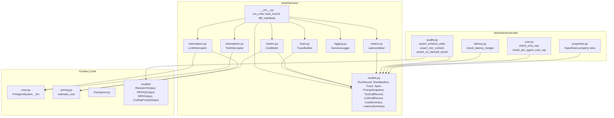
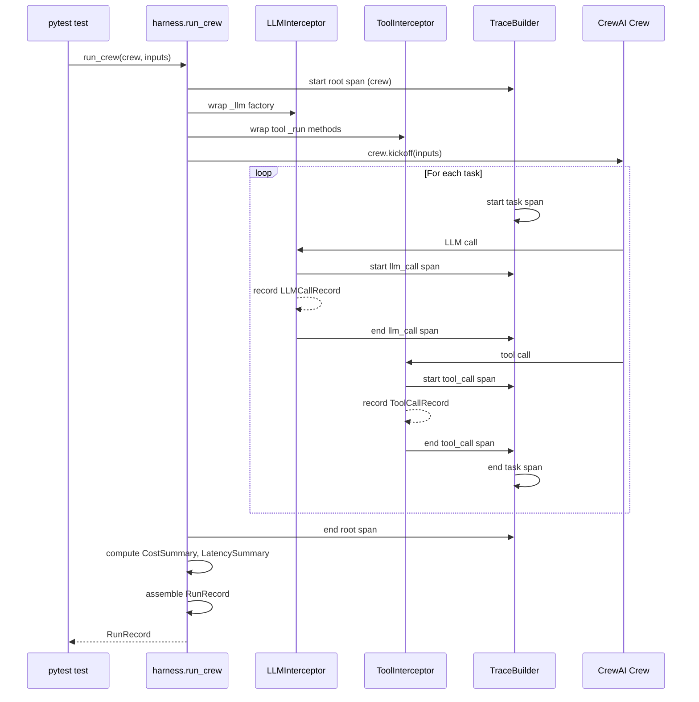
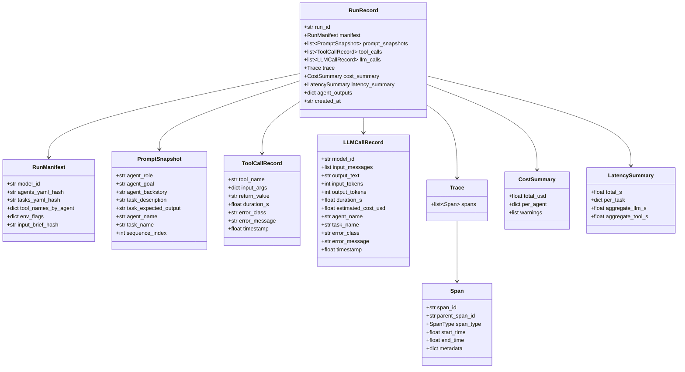

# Design Document: Agent Harness Evals

## Overview

This design describes a test harness, observability layer, and evaluation framework for the PM Working Backwards multi-agent CrewAI system. The harness wraps crew execution to capture prompts, tool calls, LLM requests/responses, and configuration into a structured run record. The observability layer instruments the harness with structured traces, cost metering, latency metering, and structured logs. The eval layer provides pytest-based assertion functions and Hypothesis property tests that verify output quality, latency budgets, cost caps, and correctness invariants.

The system is implemented as a Python module at `tests/harness/` and builds on existing infrastructure: `pricing.py` for cost estimation, `checkpoint.py` for run state patterns, and the `VaultCheckpointProvider` pattern for intercepting crew execution. No new external dependencies are introduced.

### Design Decisions

1. **Pydantic for all data models**: All harness data structures (RunRecord, RunManifest, Trace, Span, etc.) are Pydantic v2 models. This gives us JSON serialization round-trip for free, schema validation, and consistency with the existing codebase where every agent output is a Pydantic model.

2. **Interceptor pattern over monkey-patching**: The LLM and tool interceptors wrap the existing `_llm()` factory and tool `_run` methods using decorator/wrapper patterns rather than monkey-patching. This mirrors the `VaultCheckpointProvider` pattern already used in the project and keeps interception transparent.

3. **Replay via sequential matching**: Replay mode serves canned responses by matching calls in sequence order (first LLM call gets first recorded response, etc.) rather than by content matching. Sequential matching is simpler, deterministic, and sufficient because CrewAI executes tasks in a fixed order.

4. **Trace as a flat span list**: The trace is a flat list of Span objects with parent_span_id references, not a nested tree structure. This simplifies serialization and querying while still supporting tree traversal when needed.

5. **Harness is test-only**: The harness module lives in `tests/harness/`, not in `src/`. It is never imported by production code. This keeps the production dependency surface unchanged.

6. **Reuse `pricing.estimate_cost`**: Cost metering delegates to the existing `pricing.estimate_cost` function rather than reimplementing rate lookups. This ensures cost estimation stays consistent across the CLI and the harness.

## Architecture



### Execution Flow



## Components and Interfaces

### 1. Harness Entry Point (`tests/harness/__init__.py`)

The public API surface. Three functions:

```python
def run_crew(
    crew: Crew,
    inputs: dict[str, str],
    replay_path: str | None = None,
    output_path: str | None = None,
    strict_manifest: bool = False,
) -> RunRecord:
    """Execute a crew through the harness with full interception.

    When replay_path is None, runs against live APIs.
    When replay_path points to a RunRecord JSON file, runs in replay mode.
    When output_path is provided, writes the RunRecord to that path.
    When strict_manifest is True and replay manifest differs, raises ManifestDriftError.
    """

def load_record(path: str) -> RunRecord:
    """Read a RunRecord JSON file and return a validated Pydantic model."""

def diff_manifests(a: RunManifest, b: RunManifest) -> dict[str, tuple]:
    """Compare two RunManifests. Returns {field_name: (old_value, new_value)} for differing fields."""
```

### 2. Data Models (`tests/harness/models.py`)

All Pydantic v2 `BaseModel` subclasses. JSON-serializable via `model_dump_json()` / `model_validate_json()`.

**RunManifest**: Frozen configuration snapshot.
- `model_id: str`
- `agents_yaml_hash: str` (SHA-256)
- `tasks_yaml_hash: str` (SHA-256)
- `tool_names_by_agent: dict[str, list[str]]`
- `env_flags: dict[str, bool]` (LLM_PROVIDER, DOVETAIL_API_TOKEN presence, etc.)
- `input_brief_hash: str` (SHA-256)

**PromptSnapshot**: Captured prompt text per agent per task.
- `agent_role: str`
- `agent_goal: str`
- `agent_backstory: str`
- `task_description: str`
- `task_expected_output: str`
- `agent_name: str`
- `task_name: str`
- `sequence_index: int`

**ToolCallRecord**: Single tool invocation.
- `tool_name: str`
- `input_args: dict`
- `return_value: str`
- `duration_s: float`
- `error_class: str | None`
- `error_message: str | None`
- `timestamp: float` (monotonic)

**LLMCallRecord**: Single LLM API call.
- `model_id: str`
- `input_messages: list[dict[str, str]]`
- `output_text: str`
- `input_tokens: int`
- `output_tokens: int`
- `duration_s: float`
- `estimated_cost_usd: float`
- `agent_name: str`
- `task_name: str`
- `error_class: str | None`
- `error_message: str | None`
- `timestamp: float` (monotonic)

**SpanType**: String enum with values `crew`, `task`, `llm_call`, `tool_call`.

**Span**: Single trace node.
- `span_id: str` (UUID4)
- `parent_span_id: str | None`
- `span_type: SpanType`
- `start_time: float` (monotonic seconds)
- `end_time: float` (monotonic seconds)
- `metadata: dict`

**Trace**: Collection of spans for a run.
- `spans: list[Span]`

**CostSummary**: Aggregated cost data.
- `total_usd: float`
- `per_agent: dict[str, float]`
- `warnings: list[str]`

**LatencySummary**: Aggregated timing data.
- `total_s: float`
- `per_task: dict[str, float]`
- `aggregate_llm_s: float`
- `aggregate_tool_s: float`

**RunRecord**: Top-level container for a single crew execution.
- `run_id: str` (UUID4)
- `manifest: RunManifest`
- `prompt_snapshots: list[PromptSnapshot]`
- `tool_calls: list[ToolCallRecord]`
- `llm_calls: list[LLMCallRecord]`
- `trace: Trace`
- `cost_summary: CostSummary`
- `latency_summary: LatencySummary`
- `agent_outputs: dict[str, str]` (agent_name to raw JSON output)
- `created_at: str` (ISO 8601)

### 3. Interceptors (`tests/harness/interceptors.py`)

**LLMInterceptor**: Wraps the `_llm()` factory function from `crew.py`. In live mode, it calls the real LLM and records the call. In replay mode, it returns the next canned response from the stored RunRecord.

```python
class LLMInterceptor:
    def __init__(
        self,
        original_llm_factory: Callable,
        trace_builder: TraceBuilder,
        replay_calls: list[LLMCallRecord] | None = None,
    ):
        self.records: list[LLMCallRecord] = []
        self._replay_calls = replay_calls
        self._replay_index = 0

    def wrapped_llm(self, max_tokens: int = 8192):
        """Return an LLM instance that records or replays calls."""
```

**ToolInterceptor**: Wraps each tool's `_run` method. In live mode, calls the real tool and records the call. In replay mode, returns the next canned response.

```python
class ToolInterceptor:
    def __init__(
        self,
        trace_builder: TraceBuilder,
        replay_calls: list[ToolCallRecord] | None = None,
    ):
        self.records: list[ToolCallRecord] = []

    def wrap_tool(self, tool) -> None:
        """Replace tool._run with an intercepting wrapper."""
```

### 4. Trace Builder (`tests/harness/trace.py`)

Manages span lifecycle during a crew run.

```python
class TraceBuilder:
    def __init__(self):
        self.spans: list[Span] = []
        self._stack: list[str] = []  # span_id stack for parent tracking

    def start_span(self, span_type: SpanType, metadata: dict | None = None) -> str:
        """Create and push a new span. Returns span_id."""

    def end_span(self, span_id: str) -> None:
        """Set end_time on the span and pop from stack."""

    def build_trace(self) -> Trace:
        """Return the completed Trace."""
```

### 5. Meters (`tests/harness/meters.py`)

**CostMeter**: Computes cost summary from LLM call records.

```python
class CostMeter:
    @staticmethod
    def compute(llm_calls: list[LLMCallRecord]) -> CostSummary:
        """Sum estimated_cost_usd across all calls, grouped by agent_name.
        Uses pricing.estimate_cost for consistency.
        Records a warning for any call where model_id is not in MODEL_PRICING."""
```

**LatencyMeter**: Computes latency summary from a Trace.

```python
class LatencyMeter:
    @staticmethod
    def compute(trace: Trace) -> LatencySummary:
        """Extract total, per-task, aggregate LLM, and aggregate tool durations from spans."""
```

### 6. Structured Logging (`tests/harness/logging.py`)

Emits Python `logging` records on a dedicated `harness` logger with structured `extra` fields.

```python
def emit_event(
    event_type: str,
    span_id: str,
    run_id: str,
    **kwargs,
) -> None:
    """Emit a structured log record at INFO level on the 'harness' logger."""
```

Event types: `crew_start`, `crew_end`, `task_start`, `task_end`, `llm_call_start`, `llm_call_end`, `tool_call_start`, `tool_call_end`.

### 7. Eval Functions (`tests/harness/evals/`)

**quality.py**: Output quality assertions.
- `assert_schema_valid(record: RunRecord)`: Validates each agent output against its Pydantic schema.
- `assert_min_content(record: RunRecord)`: Checks minimum content requirements per agent.
- `assert_no_banned_words(record: RunRecord)`: Scans outputs for banned words.

**latency.py**: Latency budget assertions.
- `check_latency_budget(record: RunRecord, budgets: dict[str, float], total_budget: float)`: Raises AssertionError if any task or total exceeds budget.

**cost.py**: Cost cap assertions.
- `check_cost_cap(record: RunRecord, max_cost_usd: float)`: Raises AssertionError if total cost exceeds cap.
- `check_per_agent_cost_cap(record: RunRecord, caps: dict[str, float])`: Raises AssertionError if any agent exceeds its cap.

**properties.py**: Hypothesis property tests for correctness invariants.

### 8. Custom Exceptions (`tests/harness/exceptions.py`)

```python
class HarnessConfigError(Exception):
    """Raised when required config files (agents.yaml, tasks.yaml) cannot be read."""

class ReplayExhaustedError(Exception):
    """Raised when replay runs out of canned responses."""

class ManifestDriftError(Exception):
    """Raised in strict mode when replay manifest differs from current config."""
```

## Data Models

All models are Pydantic v2 `BaseModel` subclasses defined in `tests/harness/models.py`. Duration fields use `float` (seconds). Datetime fields use ISO 8601 strings. The full model hierarchy:



### Serialization Contract

- `RunRecord.model_dump_json(indent=2)` produces human-readable JSON.
- `RunRecord.model_validate_json(json_str)` reconstructs the model.
- All `float` duration fields are seconds (monotonic clock).
- The `created_at` field is ISO 8601 UTC.
- The `input_messages` field on `LLMCallRecord` is `list[dict[str, str]]` where each dict has `role` and `content` keys.


## Correctness Properties

*A property is a characteristic or behavior that should hold true across all valid executions of a system. Properties serve as the bridge between human-readable specifications and machine-verifiable correctness guarantees.*

### Property 1: RunRecord serialization round-trip

*For any* valid RunRecord instance, serializing to JSON via `model_dump_json()` and deserializing via `model_validate_json()` SHALL produce an object where every field compares equal to the original.

**Validates: Requirements 1.2, 6.5, 7.5, 14.4, 15.1, 15.4**

### Property 2: Manifest diff correctness

*For any* two RunManifest instances, `diff_manifests(a, b)` SHALL return a dictionary where every key maps to a `(old_value, new_value)` tuple where `old_value != new_value`, and every field not in the dictionary has equal values in both manifests.

**Validates: Requirements 1.3, 6.6**

### Property 3: Tool interceptor transparency

*For any* tool and any input arguments, invoking the tool through the ToolInterceptor SHALL return the same value as invoking the tool directly without the interceptor.

**Validates: Requirements 3.2**

### Property 4: Tool interceptor error transparency

*For any* tool that raises an exception for a given input, invoking the tool through the ToolInterceptor SHALL re-raise the same exception type with the same message, and SHALL record the error_class and error_message in the ToolCallRecord.

**Validates: Requirements 3.4**

### Property 5: LLM interceptor transparency

*For any* LLM call with any input messages, invoking the LLM through the LLMInterceptor SHALL return the same response text and token counts as invoking the LLM directly without the interceptor.

**Validates: Requirements 4.3**

### Property 6: LLM interceptor error transparency

*For any* LLM call that raises an API error, invoking the LLM through the LLMInterceptor SHALL re-raise the same exception type with the same message, and SHALL record the error_class and error_message in the LLMCallRecord.

**Validates: Requirements 4.5**

### Property 7: Record list ordering invariant

*For any* valid RunRecord, the `prompt_snapshots` list SHALL have monotonically increasing `sequence_index` values, the `tool_calls` list SHALL have monotonically non-decreasing `timestamp` values, and the `llm_calls` list SHALL have monotonically non-decreasing `timestamp` values.

**Validates: Requirements 2.3, 3.3, 4.4**

### Property 8: Cost additive invariant

*For any* list of LLMCallRecords, the CostMeter total_usd SHALL equal the sum of `estimated_cost_usd` across all records, and the sum of all per-agent costs SHALL equal total_usd. Each individual `estimated_cost_usd` SHALL equal `pricing.estimate_cost(model_id, input_tokens, output_tokens)`.

**Validates: Requirements 8.1, 8.2, 8.3, 14.2**

### Property 9: Latency meter correctness

*For any* valid Trace, the LatencyMeter SHALL compute `total_s` equal to the root span's `end_time - start_time`, each `per_task` duration equal to its task span's `end_time - start_time`, `aggregate_llm_s` equal to the sum of all `llm_call` span durations, and `aggregate_tool_s` equal to the sum of all `tool_call` span durations.

**Validates: Requirements 9.1, 9.2, 9.3, 9.5**

### Property 10: Span containment invariant

*For any* valid Trace tree, every child Span's time range `[start_time, end_time]` SHALL fall within its parent Span's time range `[start_time, end_time]`.

**Validates: Requirements 14.3**

### Property 11: Latency budget violation detection

*For any* RunRecord and budget dictionary, `check_latency_budget` SHALL raise AssertionError if and only if at least one task's duration exceeds its budget or the total duration exceeds the total budget. The error message SHALL list every task that exceeded its budget.

**Validates: Requirements 12.1, 12.2, 12.3**

### Property 12: Cost cap violation detection

*For any* RunRecord and cost cap, `check_cost_cap` SHALL raise AssertionError if and only if the total cost exceeds the cap. `check_per_agent_cost_cap` SHALL raise AssertionError if and only if at least one agent's cost exceeds its cap. The error message SHALL list every agent that exceeded.

**Validates: Requirements 13.1, 13.2, 13.3, 13.4**

### Property 13: Input brief hash is non-empty

*For any* non-empty input brief string, the RunManifest SHALL capture a non-empty `input_brief_hash` that is a valid 64-character hexadecimal SHA-256 string.

**Validates: Requirements 14.1**

### Property 14: Replay fidelity

*For any* recorded list of LLMCallRecords, replaying them through the LLMInterceptor in replay mode SHALL return the `output_text` from the i-th recorded call on the i-th invocation. The same holds for ToolCallRecords through the ToolInterceptor.

**Validates: Requirements 5.1, 5.2**

### Property 15: Banned word detection

*For any* string that contains at least one word from the banned word list, `assert_no_banned_words` SHALL raise AssertionError. *For any* string that contains no banned words, the assertion SHALL pass.

**Validates: Requirements 11.3**

### Property 16: Span ID uniqueness

*For any* valid Trace, all `span_id` values across all Spans SHALL be unique.

**Validates: Requirements 7.2**

### Property 17: Trace structure hierarchy

*For any* valid Trace produced by the harness, there SHALL be exactly one root Span of type `crew` with `parent_span_id = None`. Every `task` Span SHALL have the root Span as its parent. Every `llm_call` and `tool_call` Span SHALL have a `task` Span as its parent. Every `llm_call` Span's metadata SHALL contain keys `input_tokens`, `output_tokens`, `estimated_cost_usd`, and `model_id`. Every `tool_call` Span's metadata SHALL contain keys `tool_name` and `success`.

**Validates: Requirements 7.1, 7.3, 7.4**

## Error Handling

### Harness Configuration Errors

| Error Condition | Exception | Behavior |
|---|---|---|
| `agents.yaml` not found at capture time | `HarnessConfigError` | Message names the missing file. Raised before crew execution starts. |
| `tasks.yaml` not found at capture time | `HarnessConfigError` | Message names the missing file. Raised before crew execution starts. |
| RunRecord JSON file not found for replay | `FileNotFoundError` | Standard Python exception. Raised in `load_record` or `run_crew`. |
| RunRecord JSON is malformed | `pydantic.ValidationError` | Pydantic validation error. Raised in `load_record`. |

### Replay Errors

| Error Condition | Exception | Behavior |
|---|---|---|
| LLM replay sequence exhausted | `ReplayExhaustedError` | Message includes call type ("LLM") and the index at which exhaustion occurred. |
| Tool replay sequence exhausted | `ReplayExhaustedError` | Message includes call type ("tool") and the index at which exhaustion occurred. |
| Manifest drift in non-strict mode | Warning via `warnings.warn` | Lists differing fields. Replay proceeds. |
| Manifest drift in strict mode | `ManifestDriftError` | Lists differing fields. Replay aborted. |

### Interceptor Errors

| Error Condition | Behavior |
|---|---|
| Tool `_run` raises an exception | ToolInterceptor records `error_class` and `error_message` in the ToolCallRecord, then re-raises the original exception unchanged. |
| LLM API call raises an exception | LLMInterceptor records `error_class` and `error_message` in the LLMCallRecord, then re-raises the original exception unchanged. |
| Unknown model ID in pricing lookup | CostMeter records cost as 0.0 and appends a warning string to `CostSummary.warnings`. No exception raised. |

### Eval Assertion Errors

All eval assertion functions raise `AssertionError` with a descriptive message on failure. They do not catch or suppress exceptions from the RunRecord or its nested models. The descriptive message includes:
- For schema validation failures: the agent name and the Pydantic validation error.
- For content checks: the agent name and the missing field or content.
- For banned word violations: the agent name, the banned word found, and a snippet of context.
- For latency budget violations: each task that exceeded, its budget, and its actual duration.
- For cost cap violations: the cap value and the actual cost (total or per-agent).

## Testing Strategy

### Dual Testing Approach

The harness uses both unit tests and property-based tests:

- **Unit tests** (`tests/test_harness_*.py`): Verify specific examples, edge cases, error conditions, and integration points. Cover the EXAMPLE, EDGE_CASE, INTEGRATION, and SMOKE criteria from the requirements.
- **Property tests** (`tests/test_harness_properties.py`): Verify the 17 correctness properties defined above using Hypothesis. Each property test runs a minimum of 100 iterations.

### Property-Based Testing Configuration

- **Library**: [Hypothesis](https://hypothesis.readthedocs.io/) (already in `pyproject.toml` dev dependencies)
- **Minimum iterations**: 100 per property (`@settings(max_examples=100)`)
- **Deadline**: Disabled (`deadline=None`) to avoid flaky failures from slow Pydantic serialization on large generated models
- **Tag format**: Each test function includes a docstring comment: `Feature: agent-harness-evals, Property {number}: {property_text}`

### Test File Organization

```
tests/
  harness/                          # The harness module itself
    __init__.py                     # run_crew, load_record, diff_manifests
    models.py                       # Pydantic data models
    interceptors.py                 # LLMInterceptor, ToolInterceptor
    trace.py                        # TraceBuilder
    meters.py                       # CostMeter, LatencyMeter
    logging.py                      # Structured logging helpers
    exceptions.py                   # HarnessConfigError, ReplayExhaustedError, ManifestDriftError
    evals/
      __init__.py
      quality.py                    # Output quality assertions
      latency.py                    # Latency budget assertions
      cost.py                       # Cost cap assertions
      properties.py                 # Hypothesis property tests (the 17 properties)
  test_harness_models.py            # Unit tests for data models
  test_harness_interceptors.py      # Unit tests for interceptors
  test_harness_trace.py             # Unit tests for trace builder
  test_harness_meters.py            # Unit tests for cost and latency meters
  test_harness_evals.py             # Unit tests for eval assertion functions
  test_harness_api.py               # Integration tests for run_crew, load_record, diff_manifests
  test_harness_replay.py            # Integration tests for replay mode
  test_harness_logging.py           # Unit tests for structured logging
  test_harness_properties.py        # Property-based tests (imports from evals/properties.py)
```

### Unit Test Coverage

| Requirement | Test Type | Test File |
|---|---|---|
| 1.4 Missing config files | EXAMPLE | `test_harness_api.py` |
| 2.1 Prompt snapshot capture | INTEGRATION | `test_harness_interceptors.py` |
| 2.2 Interpolated snapshots | INTEGRATION | `test_harness_interceptors.py` |
| 2.4 Prompt diff | EXAMPLE | `test_harness_models.py` |
| 5.3 Replay exhaustion | EXAMPLE | `test_harness_replay.py` |
| 5.4 Manifest drift warning/error | EXAMPLE | `test_harness_replay.py` |
| 5.5 Replay produces valid RunRecord | INTEGRATION | `test_harness_replay.py` |
| 6.1 run_crew signature | SMOKE | `test_harness_api.py` |
| 6.2 Live execution | INTEGRATION | `test_harness_api.py` |
| 6.3 Replay execution | INTEGRATION | `test_harness_api.py` |
| 6.4 Output path writing | EXAMPLE | `test_harness_api.py` |
| 8.5 Unknown model warning | EXAMPLE | `test_harness_meters.py` |
| 10.1 Log event emission | EXAMPLE | `test_harness_logging.py` |
| 10.2 Log record structure | EXAMPLE | `test_harness_logging.py` |
| 10.3 Logger name | SMOKE | `test_harness_logging.py` |
| 10.4 No file handlers | SMOKE | `test_harness_logging.py` |
| 11.2 Minimum content checks | EXAMPLE | `test_harness_evals.py` |
| 11.4 Assertion error messages | EXAMPLE | `test_harness_evals.py` |
| 12.4 Missing task in budget | EXAMPLE | `test_harness_evals.py` |
| 15.2 ISO 8601 and float format | EXAMPLE | `test_harness_models.py` |
| 15.3 2-space indentation | EXAMPLE | `test_harness_models.py` |

### Property Test Coverage

| Property | Validates | Test Function |
|---|---|---|
| P1: RunRecord round-trip | 1.2, 6.5, 7.5, 14.4, 15.1, 15.4 | `test_property_1_run_record_round_trip` |
| P2: Manifest diff correctness | 1.3, 6.6 | `test_property_2_manifest_diff_correctness` |
| P3: Tool interceptor transparency | 3.2 | `test_property_3_tool_interceptor_transparency` |
| P4: Tool error transparency | 3.4 | `test_property_4_tool_error_transparency` |
| P5: LLM interceptor transparency | 4.3 | `test_property_5_llm_interceptor_transparency` |
| P6: LLM error transparency | 4.5 | `test_property_6_llm_error_transparency` |
| P7: Record list ordering | 2.3, 3.3, 4.4 | `test_property_7_record_list_ordering` |
| P8: Cost additive invariant | 8.1, 8.2, 8.3, 14.2 | `test_property_8_cost_additive_invariant` |
| P9: Latency meter correctness | 9.1, 9.2, 9.3, 9.5 | `test_property_9_latency_meter_correctness` |
| P10: Span containment | 14.3 | `test_property_10_span_containment` |
| P11: Latency budget detection | 12.1, 12.2, 12.3 | `test_property_11_latency_budget_detection` |
| P12: Cost cap detection | 13.1, 13.2, 13.3, 13.4 | `test_property_12_cost_cap_detection` |
| P13: Input brief hash | 14.1 | `test_property_13_input_brief_hash` |
| P14: Replay fidelity | 5.1, 5.2 | `test_property_14_replay_fidelity` |
| P15: Banned word detection | 11.3 | `test_property_15_banned_word_detection` |
| P16: Span ID uniqueness | 7.2 | `test_property_16_span_id_uniqueness` |
| P17: Trace structure hierarchy | 7.1, 7.3, 7.4 | `test_property_17_trace_structure_hierarchy` |

### Hypothesis Strategy Design

Key custom strategies for generating test data:

- **`run_manifest_strategy()`**: Generates RunManifest with random model IDs, SHA-256 hex strings, tool name lists, and env flag dicts.
- **`llm_call_record_strategy()`**: Generates LLMCallRecord with random model IDs from `MODEL_PRICING` keys, random token counts (0-10000), and costs computed via `pricing.estimate_cost`.
- **`tool_call_record_strategy()`**: Generates ToolCallRecord with random tool names, input dicts, return values, and durations.
- **`valid_trace_strategy()`**: Generates a Trace with proper hierarchy (one crew root, N task children, M llm_call/tool_call leaves per task) and valid containment (child time ranges within parent).
- **`run_record_strategy()`**: Composes all sub-strategies into a valid RunRecord with consistent cost and latency summaries.

These strategies follow the same patterns used in `tests/test_compliance_properties.py` (e.g., `@st.composite` decorators, `_SAFE_TEXT` alphabet restrictions, `@settings(max_examples=100, deadline=None)`).
