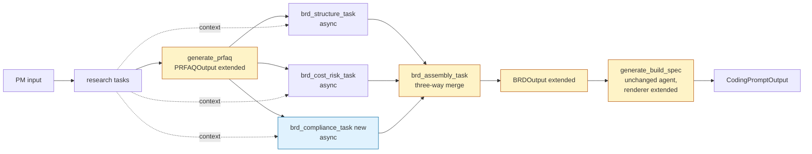

# Design Document

## Overview

This design adds a compliance-aware workstream to the split BRD pipeline without changing the pipeline shape. A new async sibling task, `brd_compliance_task`, runs in parallel with the existing `brd_structure_task` and `brd_cost_risk_task`. Its typed output, `BRDComplianceOutput`, is merged by the existing `brd_assembly_task` into an extended `BRDOutput`. The existing build spec agent renders the new fields through renderer changes only. The PRFAQ agent gains a structured data handling field so the compliance task has an upstream anchor.

The architectural shape being extended is the three-into-one split BRD pattern already in `src/pm_agent_system/crew.py` (see `split_brd_crew` and `full_pipeline_crew`). This feature preserves that pattern exactly, adding a third sibling to the existing two.

This is a latency-neutral addition. The new task runs async in parallel. The structure task is the longest-running sibling today, so as long as compliance finishes under the structure ceiling, end-to-end wall clock stays within the +10 percent envelope required by requirement 14.

Scope constraints from the requirements:
- Generic, public-repo-safe language only. No organization-internal nouns, portal names, policy numbers, or domain references anywhere.
- AWS-first defaults for all technical references (Lambda, DynamoDB, Cognito, API Gateway, S3, CloudFront, KMS, CloudWatch).
- "The system shall..." phrasing for requirement-style statements.
- Banned-word list enforced on agent prompts and outputs.
- Zero new CrewAI agents or tasks in the build spec path. Rendering only.

## Architecture

Split BRD topology showing the three parallel siblings feeding assembly, which feeds the build spec. Unchanged stages are shaded by absence of annotation. New or extended stages are annotated with `[new]` or `[extended]`.



The three sibling tasks run with `async_execution=True`. CrewAI auto-joins them before the assembly task runs. Each sibling has a dedicated agent to prevent Bedrock tool-use and tool-result interleaving. The isolation rationale is the same one that justifies `brd_cost_risk_agent` today.

## Components and Interfaces

### brd_compliance_agent (new)

Defined in `src/pm_agent_system/config/agents.yaml`.

- **role**: Compliance and Risk Analyst for BRDs.
- **goal**: Produce a typed compliance intermediate covering data handling, vendor considerations, privacy, compliance gates, launch readiness, and post-launch maintenance. Work in parallel with the structure and cost-risk specialists. Never write BRD prose, user stories, or functional requirements.
- **backstory summary**: Specialist who reads the approved PRFAQ and the research brief, enumerates data elements, classifies each, applies the five-level classification taxonomy, detects vendor risk scenarios, proposes privacy mitigations, and assembles a launch readiness checklist. Always generic. AWS-first defaults. Banned-word list enforced. No organization-internal nouns.
- **tools**: `FileReaderTool` required, `TavilySearchTool` optional. No other tools. No Dovetail. No AWS docs. No pricing tool.
- **isolation rationale**: A dedicated agent instance prevents tool-use and tool-result messages from interleaving across concurrent agents under `async_execution=True`. This mirrors the existing isolation of `brd_cost_risk_agent` from `brd_agent`.

Agent sketch for `agents.yaml`:

```yaml
brd_compliance_agent:
  role: >
    Compliance and Risk Analyst for BRDs
  goal: >
    Produce a typed compliance intermediate covering data handling,
    vendor considerations, privacy, compliance gates, launch readiness,
    and post-launch maintenance. Run in parallel with the structure and
    cost-risk specialists. Do not write BRD prose, user stories, or
    functional requirements.
  backstory: >
    ...generic framing, AWS-first defaults, banned-word list,
    prohibition on em dashes and contrast hooks, "The system shall..."
    phrasing for requirement-style statements, zero organization-internal
    nouns...
  verbose: true
  allow_delegation: false
```

### brd_compliance_task (new)

Defined in `src/pm_agent_system/config/tasks.yaml`. Attached in `crew.py` with `async_execution=True`, agent set to `brd_compliance_agent()`, and `context` set to the upstream research and PRFAQ tasks (same pattern as `brd_cost_risk_task`).

Task skeleton:

```yaml
brd_compliance_task:
  description: >
    Produce the compliance intermediate for a BRD. Run in parallel with
    the structure and cost-risk tasks. You do NOT see their outputs.

    Inputs:
      Approved PRFAQ file path: {prfaq_path}
      Research brief file path: {research_path}
      Known Constraints: {known_constraints}
      Business Context: {business_context}

    Process:
      1. Read the PRFAQ via file_reader. Focus on the data handling
         section and the appendix_gaps.
      2. If research_path is non-empty, read it via file_reader.
      3. Enumerate each data element the product will collect, process,
         store, or transmit. Ground every element in the PRFAQ data
         handling section or the PM input. Do not fabricate.
      4. Assign each element one Data_Classification value:
         Public, Confidential, Highly Confidential, Restricted, Critical.
      5. Derive Dataset_Classification as the highest element value,
         using the order Public < Confidential < Highly Confidential
         < Restricted < Critical.
      6. Evaluate the seven vendor risk scenarios and record which
         apply. Produce vendor considerations in generic language.
      7. Produce privacy risks grounded in the classifications.
         Propose mitigations covering encryption in transit, encryption
         at rest, access controls, data minimization, and retention
         limits. Set the privacy design review flag when any element
         at Confidential or higher represents personal data.
      8. List applicable compliance gates from {security review,
         privacy review, legal or contract review, procurement review}.
         Include the start-early note verbatim.
      9. Produce the launch readiness checklist with the required
         minimum items. Gate Owner values restricted to the owner
         enum. Evidence Reference points to a BRD section or PRFAQ
         reference, or is left empty.
     10. Produce the post-launch maintenance section.
     11. If the PRFAQ data handling section is missing or empty, set
         the gap flag, record a descriptive gap entry, and do not
         fabricate data elements.
     12. Return as a BRDComplianceOutput JSON.

    Rules:
      - AWS-first defaults for all technical references.
      - "The system shall..." phrasing for requirement-style statements.
      - Zero banned words. Zero em dashes used as punctuation.
      - Zero organization-internal portal names, policy numbers,
        service brands, or internal URL patterns.
      - If the DOVETAIL_API_TOKEN environment variable is unset, this
        task is unaffected. It does not call Dovetail.
      - If the Tavily API key is unset, proceed using only PRFAQ and
        PM input. Record any attempted regulation lookups as gaps.

  expected_output: >
    A BRDComplianceOutput JSON with data elements classified, dataset
    classification derived, vendor considerations, privacy risks with
    mitigations, applicable compliance gates with the start-early note,
    launch readiness checklist with the minimum required items, and
    post-launch maintenance section.

  agent: brd_compliance_agent
  human_input: false
```

Crew wiring sketch for `crew.py` (pattern mirrors the existing cost-risk sibling):

```python
brd_compliance_task = Task(
    config=self.tasks_config["brd_compliance_task"],
    output_pydantic=BRDComplianceOutput,
    context=[research, prfaq_task],   # same pattern as brd_cost_risk_task
    name="brd_compliance_task",
    agent=self.brd_compliance_agent(),
    async_execution=True,
)
brd_assembly_task = Task(
    config=self.tasks_config["brd_assembly_task"],
    output_pydantic=BRDOutput,
    context=[brd_structure_task, brd_cost_risk_task, brd_compliance_task],
    name="brd_assembly_task",
    agent=self.brd_agent(),
)
```

Both `full_pipeline_crew` and `split_brd_crew` receive the same treatment. The agent list for each crew grows by one entry: `self.brd_compliance_agent()`.

### BRDComplianceOutput (new Pydantic model)

Defined in `src/pm_agent_system/models/brd_intermediate.py` alongside the two existing intermediates. Field list and enum constraints below in the Data Models section.

Gap flag semantics:
- `data_handling_gap_flag: bool` is True when upstream input was insufficient to produce data handling content. The agent sets it true in two cases: (a) the PRFAQ data handling section is missing or empty, or (b) the PM input file referenced by FileReaderTool is missing.
- When True, `data_elements` must be an empty list, `dataset_classification` must be `None`, and `data_handling_gaps` must contain at least one descriptive entry.
- A Pydantic validator enforces the pairing. This prevents a true gap flag from shipping alongside fabricated data elements.

### BRDOutput extensions

Defined in `src/pm_agent_system/models/brd_output.py`. New fields appended at the end of the model. All new fields default to empty collections or empty strings so existing BRD fixtures continue to validate without edits.

New fields:
- `data_handling_section: DataHandlingSection` (nested model with elements, dataset_classification, gap_flag, gap_notes).
- `vendor_considerations: str`.
- `vendor_scenarios_applied: list[str]` (subset of the seven vendor risk scenario names).
- `privacy_considerations: PrivacyConsiderations` (nested model with risks, mitigations, design_review_flag).
- `compliance_gates: list[ComplianceGate]` (each with name, note, owner).
- `launch_readiness_checklist: list[LaunchReadinessItem]` (Item, Applies To, Gate Owner, Evidence Reference).
- `post_launch_maintenance: str`.

Backward compatibility: every new field has a default value (empty string, empty list, or a nested model with empty defaults). Existing BRD fixtures load unchanged. Tests cover this (see Testing Strategy).

### PRFAQOutput extensions

Defined in `src/pm_agent_system/models/prfaq_output.py`.

New field:
- `data_handling: PRFAQDataHandling` with:
  - `elements: list[PRFAQDataElement]` where each element has `name: str`, `classification: DataClassification`, `purpose: str`.
  - `gap_flag: bool` default False.
  - `gap_notes: list[str]` default empty.

The PRFAQ agent prompt is updated to:
1. Enumerate each data element the product will collect, process, store, or transmit, grounded in PM input.
2. Classify each element against the five-level taxonomy.
3. When the PM input contains no data handling information, record a gap entry in `appendix_gaps`, set `data_handling.gap_flag = True`, and leave `elements` empty. Do not fabricate.

### brd_assembly_task (updated)

The existing task now consumes three typed intermediates. No new agent required for assembly in the MUST scope. The task description is updated to list the three inputs and to copy the compliance fields into the extended `BRDOutput` verbatim.

Three-way merge logic (inside the existing `brd_agent`-attached task):
- Copy all `BRDStructureOutput` fields into `BRDOutput` as before.
- Copy all `BRDCostRiskOutput` fields into `BRDOutput` as before.
- Copy `BRDComplianceOutput` fields into the new `BRDOutput` fields, preserving classifications and gate owners verbatim.
- Dataset_Classification passes through unchanged.

Error handling when an intermediate is missing or invalid: the task raises an assembly error naming the missing intermediate and does not emit a partial `BRDOutput`. CrewAI surfaces this as a task failure which the orchestrator handles through existing error paths.

### Build spec renderer additions

The build spec agent is unchanged structurally. STRIDE stub and RACI matrix rendering is deterministic and produced entirely in `src/pm_agent_system/utils/render_build_spec.py`. The LLM-driven build spec agent does not write either artifact. This decision protects latency, token budget, and run-over-run consistency, and it lets correctness property 5 be a strict equality check rather than a substring probe.

Rationale for the deterministic split:

- STRIDE has six fixed categories and RACI has a fixed column set and owner enum. There is no creative judgment worth spending LLM tokens on.
- Keeping these artifacts out of the LLM pass reduces prompt and output size on the already-split build spec stage, lowering Bedrock timeout risk.
- Product-specific security mitigations continue to live in the BRD non-functional requirements, which the structure agent already produces. The STRIDE stub here is a scaffold, not a replacement for NFR-level mitigations.

Two deterministic renderings:

1. **STRIDE stub** via `render_stride_stub(brd_output) -> str`:
   - Returns a markdown block with one subsection per category (Spoofing, Tampering, Repudiation, Information disclosure, Denial of service, Elevation of privilege).
   - Category text is drawn from a fixed template keyed by the presence of specific data classifications and vendor scenarios. For example, Information Disclosure text references data elements at Confidential or higher; Spoofing text references Cognito and API Gateway when any API is indicated by structure output.
   - Rendered when any of these conditions is true: at least one data element is Confidential or higher, `privacy_considerations.design_review_flag` is True, or at least one vendor risk scenario applies.
   - Returns an empty string when no condition is met. The build spec output omits the STRIDE section in that case.
   - Emits no image artifact.

2. **RACI matrix** via `render_raci_matrix(brd_output) -> list[RACIRow]` and `render_raci_matrix_markdown(rows) -> str`:
   - Returns a fixed-shape matrix with rows for the owner enum {PM, Tech Lead, Engineer, Legal, Security, Privacy} and columns Responsible, Accountable, Consulted, Informed.
   - Cell values are derived deterministically from `BRDOutput` fields. Accountable is assigned to PM by default. Responsible is assigned to Tech Lead and Engineer. Consulted includes Legal when a vendor scenario applies, Security when the STRIDE stub renders, Privacy when `design_review_flag` is True. Informed includes roles not otherwise assigned.
   - Rendered when at least one vendor risk scenario applies, or `privacy_considerations.design_review_flag` is True.
   - Returns an empty list when no condition is met. The build spec output omits the RACI section in that case.

The `CodingPromptOutput` model gains two fields to carry the rendered structures so they round-trip cleanly through checkpointing and inspection:

- `stride_stub: str = ""`. The rendered markdown block, or empty when no trigger condition is met.
- `raci_matrix: list[RACIRow] = []`. The rendered rows, or empty.

Wiring: the assembly step that builds the `CodingPromptOutput` calls both renderer functions immediately after the LLM produces the rest of `formatted_spec`, then appends the rendered STRIDE and RACI markdown to `formatted_spec` in a fixed order. STRIDE precedes RACI, and both follow the main build spec body. No new CrewAI task and no new agent are added.

### BRD markdown renderer additions

`src/pm_agent_system/utils/render_brd.py` renders the new sections in this deterministic order, appended after the existing version history section:

1. `## 13. Data Handling` (table of elements; dataset classification stated; gap notice rendered when gap_flag is True).
2. `## 14. Vendor Considerations` (prose; explicit "no third party" statement when no scenario applies).
3. `## 15. Privacy Considerations` (risks and mitigations; design review flag stated).
4. `## 16. Compliance Gates` (list of applicable gates; start-early note rendered verbatim).
5. `## 17. Launch Readiness Checklist` (markdown table with columns Item, Applies To, Gate Owner, Evidence Reference).
6. `## 18. Post-Launch Maintenance` (prose).

Gap notice rendering when `data_handling_section.gap_flag` is True:

```markdown
> Data handling section flagged as a gap. Upstream PRFAQ did not include enough detail to enumerate data elements. See PRFAQ appendix_gaps.
```

Zero banned words and zero em dashes used as punctuation appear in any static rendering string. The renderer is deterministic and does not call any LLM.

### PRFAQ prompt additions

`generate_prfaq` task description in `tasks.yaml` gains a numbered step for data handling:

1. **Enumerate data elements.** Walk the customer experience narrative and the PM input. List each data element the product will collect, process, store, or transmit.
2. **Classify each element.** Assign one value from {Public, Confidential, Highly Confidential, Restricted, Critical}.
3. **Handle missing data handling input.** If the PM input contains no data handling information, record a gap entry in `appendix_gaps`, set `data_handling.gap_flag = True`, and leave `data_handling.elements` empty. Do not fabricate elements.

## Data Models

### DataClassification and GateOwner enums

```python
from enum import Enum

class DataClassification(str, Enum):
    PUBLIC = "Public"
    CONFIDENTIAL = "Confidential"
    HIGHLY_CONFIDENTIAL = "Highly Confidential"
    RESTRICTED = "Restricted"
    CRITICAL = "Critical"

# Ordering for dataset-classification derivation:
_DATA_CLASS_ORDER = {
    DataClassification.PUBLIC: 0,
    DataClassification.CONFIDENTIAL: 1,
    DataClassification.HIGHLY_CONFIDENTIAL: 2,
    DataClassification.RESTRICTED: 3,
    DataClassification.CRITICAL: 4,
}

class GateOwner(str, Enum):
    PM = "PM"
    TECH_LEAD = "Tech Lead"
    ENGINEER = "Engineer"
    LEGAL = "Legal"
    SECURITY = "Security"
    PRIVACY = "Privacy"
```

### BRDComplianceOutput

```python
from pydantic import BaseModel, Field, model_validator

class DataElement(BaseModel):
    name: str
    classification: DataClassification
    purpose: str = ""

class ComplianceGate(BaseModel):
    name: str = Field(
        description='One of "security review", "privacy review", '
        '"legal or contract review", "procurement review"'
    )
    note: str = Field(
        default="start early, run in parallel, do not launch with open "
        "Critical or High findings"
    )
    owner: GateOwner

class LaunchReadinessItem(BaseModel):
    item: str
    applies_to: str
    gate_owner: GateOwner
    evidence_reference: str = ""   # empty when no evidence yet

class PrivacyConsiderations(BaseModel):
    risks: list[str] = Field(default_factory=list)
    mitigations: list[str] = Field(default_factory=list)
    design_review_flag: bool = False

class BRDComplianceOutput(BaseModel):
    data_elements: list[DataElement] = Field(default_factory=list)
    dataset_classification: DataClassification | None = None
    vendor_considerations: str = ""
    vendor_scenarios_applied: list[str] = Field(default_factory=list)
    privacy_considerations: PrivacyConsiderations = Field(
        default_factory=PrivacyConsiderations
    )
    compliance_gates: list[ComplianceGate] = Field(default_factory=list)
    launch_readiness_checklist: list[LaunchReadinessItem] = Field(
        default_factory=list
    )
    post_launch_maintenance: str = ""
    data_handling_gap_flag: bool = False
    data_handling_gaps: list[str] = Field(default_factory=list)

    @model_validator(mode="after")
    def _validate_gap_pairing(self):
        if self.data_handling_gap_flag:
            if self.data_elements:
                raise ValueError(
                    "data_handling_gap_flag is True but data_elements is non-empty"
                )
            if self.dataset_classification is not None:
                raise ValueError(
                    "data_handling_gap_flag is True but dataset_classification is set"
                )
            if not self.data_handling_gaps:
                raise ValueError(
                    "data_handling_gap_flag is True but data_handling_gaps is empty"
                )
        return self
```

### BRDOutput extensions

```python
class DataHandlingSection(BaseModel):
    elements: list[DataElement] = Field(default_factory=list)
    dataset_classification: DataClassification | None = None
    gap_flag: bool = False
    gap_notes: list[str] = Field(default_factory=list)

class BRDOutput(BaseModel):
    # ...existing fields unchanged...

    # New compliance fields (all defaulted for backward compatibility):
    data_handling_section: DataHandlingSection = Field(
        default_factory=DataHandlingSection
    )
    vendor_considerations: str = ""
    vendor_scenarios_applied: list[str] = Field(default_factory=list)
    privacy_considerations: PrivacyConsiderations = Field(
        default_factory=PrivacyConsiderations
    )
    compliance_gates: list[ComplianceGate] = Field(default_factory=list)
    launch_readiness_checklist: list[LaunchReadinessItem] = Field(
        default_factory=list
    )
    post_launch_maintenance: str = ""
```

### PRFAQOutput extensions

```python
class PRFAQDataElement(BaseModel):
    name: str
    classification: DataClassification
    purpose: str = ""

class PRFAQDataHandling(BaseModel):
    elements: list[PRFAQDataElement] = Field(default_factory=list)
    gap_flag: bool = False
    gap_notes: list[str] = Field(default_factory=list)

class PRFAQOutput(BaseModel):
    # ...existing fields unchanged...
    data_handling: PRFAQDataHandling = Field(default_factory=PRFAQDataHandling)
```

### CodingPromptOutput extensions

```python
class RACIRow(BaseModel):
    role: str      # PM, Tech Lead, Engineer, Legal, Security, Privacy
    responsible: bool = False
    accountable: bool = False
    consulted: bool = False
    informed: bool = False

class CodingPromptOutput(BaseModel):
    # ...existing fields unchanged...
    stride_stub: str = ""
    raci_matrix: list[RACIRow] = Field(default_factory=list)
```

Both fields are populated by the deterministic renderer functions in `render_build_spec.py`. The LLM does not write to them.

## Data Classification Taxonomy

Five levels in ordered sequence, lowest sensitivity to highest:

1. **Public**. Information intended for public availability with no restriction on disclosure.
2. **Confidential**. General non-public information that requires access control but has limited harm potential if disclosed.
3. **Highly Confidential**. Non-public information whose disclosure would cause notable harm to customers or the business.
4. **Restricted**. Information whose disclosure would cause severe harm or trigger regulatory or contractual exposure.
5. **Critical**. Information whose disclosure or loss would cause the highest severity impact, including legal, financial, or safety consequences.

Descriptions are generic by design. They carry no organization-internal framing, policy reference, or portal name.

## Vendor Risk Scenarios

Seven generic categories. The compliance agent evaluates PRFAQ and PM input against each and records which apply. All language is generic.

1. **Data sharing**. The product sends customer or internal data to a third party, or receives such data from one.
2. **Data handling**. A third party stores, processes, or transmits customer or internal data on our behalf.
3. **Content hosting**. A third party hosts user-generated or product-generated content visible to customers.
4. **Product development**. A third party contributes to building or extending the product, including code, models, or components.
5. **Environment connection**. A third-party system connects to our production or non-production environments.
6. **SaaS usage**. The product depends on a third-party SaaS offering as a required runtime component.
7. **Endorsement or referral**. The product is promoted to, or promotes, a third-party audience through contractual means.

When at least one scenario applies, the agent produces vendor considerations naming contract review, security review expectations, and data sharing boundaries in generic language. When none apply, the agent states explicitly that no third party is involved.

## Launch Readiness Checklist Template

Markdown table with four columns. Gate Owner constrained to `GateOwner` enum values.

| Item | Applies To | Gate Owner | Evidence Reference |
| --- | --- | --- | --- |
| Data classification sign-off | All data elements | PM | BRD data handling section |
| Privacy mitigation sign-off | Elements at Confidential and above | Privacy | BRD privacy considerations |
| Security review status | Architecture and integrations | Security | BRD technical context |
| Monitoring or alarm setup | Production workload | Engineer | BRD non-functional requirements |
| Runbook availability | Operational procedures | Tech Lead | Runbook pointer |
| Rollback plan | Deployment scope | Tech Lead | BRD timeline section |

The six items above are the minimum set. The agent may append additional rows when PRFAQ content implies them (for example, a procurement review row when a SaaS vendor scenario applies, owned by PM or Legal). The agent leaves Evidence Reference empty when no evidence is yet available rather than fabricating a link.

## Correctness Properties

*A property is a characteristic or behavior that should hold true across all valid executions of a system, a formal statement about what the system should do. Properties serve as the bridge between human-readable specifications and machine-verifiable correctness guarantees.*

Prework analysis classified each acceptance criterion into PROPERTY, EXAMPLE, EDGE_CASE, INTEGRATION, or SMOKE. The universal rules identified as PROPERTY are captured below. Content-generation rules, prompt-content checks, and pipeline-wiring assertions are handled as example, edge-case, integration, or smoke tests (see Testing Strategy).

Redundancy reflection completed. Separate enum properties for `DataClassification` and `GateOwner` were consolidated into one schema-enforcement property. Separate properties for "assembly preserves structure fields" and "assembly preserves compliance fields" were consolidated into one preservation property that also subsumes dataset-classification pass-through. Separate properties for "gap notice renders" and "section headers render in order" were consolidated into one rendering-preservation property. Separate properties for "STRIDE stub renders when triggered" and "RACI matrix renders when triggered" were folded into the rendering-preservation property.

### Property 1: Enum values are bounded at schema level

*For any* attempted construction of `DataElement`, `LaunchReadinessItem`, or `ComplianceGate` with a classification or gate owner value outside the declared enum set, Pydantic raises a `ValidationError`. *For any* construction with values inside the enum set, construction succeeds. The enum sets are {Public, Confidential, Highly Confidential, Restricted, Critical} for classifications and {PM, Tech Lead, Engineer, Legal, Security, Privacy} for gate owners.

**Validates: Requirements 1.2, 3.3, 3.4, 5.2, 9.3**

### Property 2: Dataset classification is the element-wise maximum

*For any* non-empty list of `DataElement` values, the derived `dataset_classification` equals the maximum element classification under the order Public < Confidential < Highly Confidential < Restricted < Critical. *For any* empty list (gap case), the derived `dataset_classification` is None.

**Validates: Requirements 5.3**

### Property 3: Gap flag pairing invariant

*For any* `BRDComplianceOutput` instance where `data_handling_gap_flag` is True, `data_elements` is the empty list, `dataset_classification` is None, and `data_handling_gaps` is non-empty. *For any* instance where `data_handling_gap_flag` is False, `data_elements` may hold any valid values and the model accepts the instance. The paired invariant is enforced by a model validator so no instance violating it can be constructed.

**Validates: Requirements 3.5, 5.4, 15.2, 15.3**

### Property 4: Assembly preserves intermediate content

*For any* triple of valid intermediates (`BRDStructureOutput`, `BRDCostRiskOutput`, `BRDComplianceOutput`), the assembled `BRDOutput` contains every field from every intermediate copied through without modification. Fields covered include `data_elements`, `dataset_classification`, `compliance_gates`, `launch_readiness_checklist`, acceptance criteria inside functional requirements, and pricing data inside cost flags. Byte-identical between input and output.

**Validates: Requirements 4.2, 4.4**

### Property 5: BRD rendering preserves compliance content, build spec renders STRIDE and RACI deterministically

*For any* `BRDOutput` with populated compliance fields, the rendered markdown produced by `render_brd_to_markdown` contains:
- Each new section header in the declared order after the existing twelve sections.
- Every element classification string from `data_handling_section.elements`.
- Every gate owner string from `launch_readiness_checklist`.
- The verbatim gap notice text when `data_handling_section.gap_flag` is True, naming the missing input.

*For any* `BRDOutput` where at least one element is Confidential or higher, or `privacy_considerations.design_review_flag` is True, or at least one vendor risk scenario applies, `render_stride_stub(brd_output)` returns a string containing exactly six subsection headers matching the fixed STRIDE category set, and returns the empty string for any `BRDOutput` meeting none of those conditions. *For any* `BRDOutput` where at least one vendor scenario applies or the design review flag is True, `render_raci_matrix(brd_output)` returns exactly six rows covering the owner enum, each row has exactly one Accountable and at least one Responsible, and returns the empty list for any `BRDOutput` meeting neither condition.

Because the renderers are deterministic, these are strict equality and structural-shape assertions rather than substring probes.

**Validates: Requirements 11.2, 11.3, 11.4, 12.1, 12.2**

### Property 6: Banned-word and em-dash absence in renderer static strings

*For any* `BRDOutput`, the static-template slice of the rendered markdown produced by `render_brd_to_markdown` (section headings, table headers, gap notice text, start-early note text, and other renderer-owned strings) contains zero banned words from the Banned_Word_List and zero em dashes used as punctuation. This property covers deterministic renderer output; LLM-generated content is covered by prompt-rendering and integration tests.

**Validates: Requirements 12.3**

## Error Handling

- **Gap flag semantics.** Gap flag True pairs with empty `data_elements`, None `dataset_classification`, and non-empty `data_handling_gaps`. Pydantic model validator enforces the pairing. Any attempt to ship a gap flag alongside fabricated elements raises a validation error at assembly time.
- **Missing PRFAQ data handling section.** The compliance agent sets `data_handling_gap_flag = True`, records a descriptive entry such as "PRFAQ did not include a data handling section" in `data_handling_gaps`, and returns a valid `BRDComplianceOutput`. No fabrication.
- **DOVETAIL_API_TOKEN unset.** The compliance agent does not use the Dovetail tool. This environment variable is irrelevant to its execution. No code path in the compliance task references Dovetail. Documented here for operator clarity.
- **Tavily API key unset.** The compliance agent proceeds using only PRFAQ and PM input. Any attempted privacy regulation lookup is recorded as a gap in `data_handling_gaps` or an analogous gap field on `PrivacyConsiderations`. The task does not fail.
- **Missing PM input file referenced by FileReaderTool.** The compliance agent catches the file-read error, sets `data_handling_gap_flag = True`, records an entry naming the missing file, and returns a valid `BRDComplianceOutput` with empty elements.
- **Missing intermediate at assembly time.** The assembly task raises an assembly error naming the missing intermediate and does not emit a partial `BRDOutput`. CrewAI's existing task-failure path handles surfacing the error to the operator.
- **Invalid enum values.** Attempts to assign a string outside the `DataClassification` or `GateOwner` enum fail at Pydantic model construction. The agent prompt enumerates the valid values explicitly, so LLM output that lands outside the set is caught at schema validation and prompts a retry through the existing CrewAI validation loop.

## Testing Strategy

Dual testing approach applies. Unit tests and integration tests catch concrete bugs and verify pipeline wiring. Property-based tests cover the universal rules identified above (enum enforcement, dataset classification derivation, gap-flag pairing, assembly preservation, rendering preservation).

### Unit tests

All under `tests/` with descriptive filenames mirroring the existing suite.

1. **BRDComplianceOutput enum validation.** Constructs the model with valid enum values and confirms success. Constructs with invalid classification (for example, `"Top Secret"`) and confirms `ValidationError`. Constructs with invalid gate owner (for example, `"Intern"`) and confirms `ValidationError`.
2. **Gap flag pairing validator.** Constructs with `data_handling_gap_flag=True` and non-empty `data_elements`, confirms `ValidationError`. Constructs with gap flag True and empty elements and non-empty gaps, confirms success.
3. **Prompt-rendering check for banned words and classification coverage.** Renders the `brd_compliance_task` description via the existing `tasks.yaml` loader with a representative input payload, asserts that zero banned words appear, zero em dashes appear as punctuation, and that all five classification levels are named explicitly in the rendered prompt.
4. **Markdown renderer static strings.** Asserts that the renderer's section headings, table headers, gap notice text, and start-early note text contain zero banned words and zero em dashes. Runs against a minimal `BRDOutput` fixture.
5. **BRDOutput backward compatibility.** Loads an existing BRD fixture (from `examples/brd_v1.0.md` derived YAML, or a new `tests/fixtures/brd_legacy.json`) that has no compliance fields, confirms it validates with defaults populated.

### Property-based tests

Use the existing PBT library already in the project if one is present, otherwise `hypothesis`. Minimum 100 iterations per property. Each test is tagged with a comment referencing the design property. No new top-level dependency is added without updating `pyproject.toml`.

1. Property 1: generate `DataElement` and `LaunchReadinessItem` instances, assert enum bounds.
2. Property 2: generate non-empty `list[DataElement]`, compute dataset classification via the helper, assert equality with `max(..., key=_DATA_CLASS_ORDER.get)`. Generate empty list, assert None.
3. Property 3: generate paired (gap_flag, data_elements, gaps) triples, confirm validator accepts valid pairings and rejects invalid ones.
4. Property 4: generate valid intermediate triples with the field generators, run the assembly merge function, assert field-by-field equality on the merged output.
5. Property 5: generate `BRDOutput` with random compliance fields, render markdown, assert every classification string and every owner string appears in the output.
6. Property 6: across many randomly generated `BRDOutput` instances (empty and populated), confirm banned-word absence and em-dash absence in the renderer's static-template slice of the output.

### Integration tests

1. **Split BRD crew end-to-end.** Runs `split_brd_crew` against a minimal PRFAQ fixture with a clear data handling section. Asserts the resulting `BRDOutput` contains populated `data_handling_section.elements`, non-empty `compliance_gates`, and a non-empty `launch_readiness_checklist`.
2. **Gap-handling pipeline test.** Runs the same crew against a PRFAQ fixture that lacks a data handling section. Asserts `BRDOutput.data_handling_section.gap_flag` is True, `elements` is empty, and no data elements were fabricated. Asserts the assembled `BRDOutput` also preserves the gap flag.
3. **Environment-degradation test.** Runs the pipeline with `DOVETAIL_API_TOKEN` unset. Asserts the pipeline completes without raising. Compliance agent is unaffected; this test primarily confirms no accidental coupling was introduced.
4. **Tavily-absent test.** Runs the pipeline with Tavily API key unset. Asserts `BRDComplianceOutput` still validates, with any attempted regulation lookups recorded as gaps.

### Latency verification

Comparative runs on a reference input, baseline versus new topology, with timing captured to a log. Add a helper script at `scripts/measure_brd_latency.py`:

- Inputs: a stable reference input at `examples/input.yaml`.
- Runs: 3 baseline runs (pre-feature branch), 3 new-topology runs.
- Output: JSON timing log per run with per-task durations and total wall clock.
- Assertion pattern for local validation: new-topology wall clock is within +10 percent of the baseline mean for both `full_pipeline_crew` and `split_brd_crew`.

Because the structure task is the longest-running of the three siblings today, the compliance task finishes under the structure ceiling in typical runs. The script exposes the timing so the ceiling assumption is verified, not asserted without evidence.

### Test count balance

Unit tests and schema-validation tests dominate for this feature because most requirements are about schema shape, prompt content, and rendering determinism. Property tests cover the handful of universal rules. Integration tests cover end-to-end pipeline wiring and gap handling. This balance matches the project's existing testing posture.

## Rendering Examples

Example renderings for reviewer calibration. All example content is generic. Zero banned words. Zero em dashes used as punctuation.

### BRD markdown snippet (new sections)

```markdown
## 13. Data Handling

**Dataset Classification:** Highly Confidential

| Element | Classification | Purpose |
| --- | --- | --- |
| User email | Confidential | Account identity |
| Session token | Highly Confidential | API authorization |
| Payload metadata | Public | Operational telemetry |

## 14. Vendor Considerations

Scenarios applied: data handling, SaaS usage.

The product depends on a third-party SaaS component for a runtime function. Vendor contract review, security review expectations, and data sharing boundaries apply. Contract scope covers processing of customer data at the Confidential level or higher.

## 15. Privacy Considerations

**Design review flag:** true

Risks:
- Personal data at the Confidential level flows through an external SaaS component.
- Retention of session tokens past the active session window.

Mitigations:
- Encryption in transit (TLS 1.2 or higher). Encryption at rest via KMS-managed keys for payloads in S3 and DynamoDB.
- Access controls enforced at API Gateway with Cognito-issued tokens.
- Data minimization: only fields listed in the data handling table are transmitted.
- Retention limits: session tokens expire within the policy-defined window.

## 16. Compliance Gates

- Security review. Start early, run in parallel, do not launch with open Critical or High findings. Owner: Security.
- Privacy review. Start early, run in parallel, do not launch with open Critical or High findings. Owner: Privacy.
- Legal or contract review. Start early, run in parallel, do not launch with open Critical or High findings. Owner: Legal.

## 17. Launch Readiness Checklist

| Item | Applies To | Gate Owner | Evidence Reference |
| --- | --- | --- | --- |
| Data classification sign-off | All data elements | PM | BRD section 13 |
| Privacy mitigation sign-off | Confidential and above | Privacy | BRD section 15 |
| Security review status | Architecture and integrations | Security | BRD section 7 |
| Monitoring or alarm setup | Production workload | Engineer | BRD section 6 |
| Runbook availability | Operational procedures | Tech Lead |  |
| Rollback plan | Deployment scope | Tech Lead | BRD section 11 |

## 18. Post-Launch Maintenance

Recertify vendor access and data classifications on an annual cadence. Classification updates are triggered by any of: addition of new data elements, change in data sources, change in vendor scope. Runbook and ownership pointers follow the Launch Readiness Checklist rows above.
```

### Build spec markdown snippet (STRIDE stub and RACI matrix)

```markdown
## Threat Model (STRIDE Stub)

**Spoofing.** Consider identity spoofing against the API. Mitigate with Cognito-issued tokens and API Gateway authorizer enforcement.

**Tampering.** Consider payload tampering in transit and at rest. Mitigate with TLS 1.2 or higher and KMS-managed encryption for S3 and DynamoDB.

**Repudiation.** Consider repudiation of user actions. Mitigate with CloudWatch Logs capturing request-level audit records.

**Information disclosure.** Consider unintended exposure of Confidential data. Mitigate with least-privilege IAM, field-level access controls, and retention limits.

**Denial of service.** Consider DoS against the API. Mitigate with API Gateway throttling and CloudFront edge caching.

**Elevation of privilege.** Consider privilege escalation via token misuse. Mitigate with short-lived tokens, role separation, and scoped IAM policies.

## RACI Matrix

| Role | Responsible | Accountable | Consulted | Informed |
| --- | --- | --- | --- | --- |
| PM |  | x | x |  |
| Tech Lead | x |  | x |  |
| Engineer | x |  |  | x |
| Legal |  |  | x | x |
| Security |  |  | x | x |
| Privacy |  |  | x | x |
```

Gap notice example (rendered when `data_handling_section.gap_flag` is True):

```markdown
## 13. Data Handling

> Data handling section flagged as a gap. Upstream PRFAQ did not include enough detail to enumerate data elements. See PRFAQ appendix_gaps.
```

## Out of Scope and Deferred

Mirrors requirement 18. Items explicitly out of scope for this feature:

- An organization-internal mode with internal nouns, portal names, policy numbers, or domain references.
- A separate launch readiness agent or CLI subcommand.
- Changes to the research agent, the design brief agent, or the build spec agent structurally (new tasks, new agent roles). Renderer changes only for build spec.
- New MCP tools or external integrations.
- Auto-generated STRIDE diagrams as SVG or other image artifacts.
- Compliance content for artifacts other than the BRD and PRFAQ (for example, the research brief).
- Automated evidence-link verification (the Evidence Reference column is a pointer, not a verified link).

Surfaced during design, also deferred:

- A separate `brd_compliance_renderer` module. The existing `render_brd.py` is extended in place.
- Multi-tenant compliance modes. Single generic mode only.
- Per-region data residency requirements beyond what the PM input specifies.

## Optional Extraction: No-Tools brd_assembly_agent

Requirement 17 (SHOULD). Design sketch and decision gate.

Sketch:

```yaml
# agents.yaml
brd_assembly_agent:
  role: >
    BRD Assembly Specialist
  goal: >
    Merge three typed intermediates (structure, cost-risk, compliance)
    into a single BRDOutput without adding new content or calling tools.
  backstory: >
    ...no tools, deterministic merge role, AWS-first defaults preserved...
  verbose: true
  allow_delegation: false
```

Crew wiring would replace `agent=self.brd_agent()` with `agent=self.brd_assembly_agent()` on the `brd_assembly_task`. Input and output contracts stay identical.

Rationale: mirrors the existing `research_agent` (synthesis) pattern. A no-tools assembly agent avoids the cost of the tool-bearing `brd_agent` re-entering the loop for a pure merge. Latency benefit scales with intermediate size.

Decision gate: the task plan will present this as an optional task group. The PM approves or defers during task planning. If deferred, all MUST requirements remain satisfied; the existing `brd_agent` continues to carry the assembly task.
