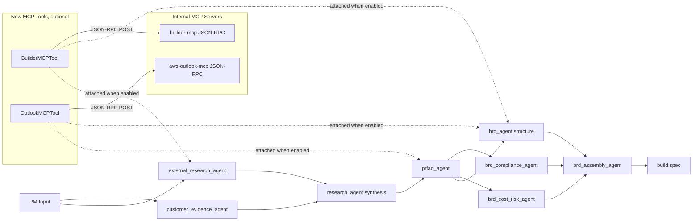
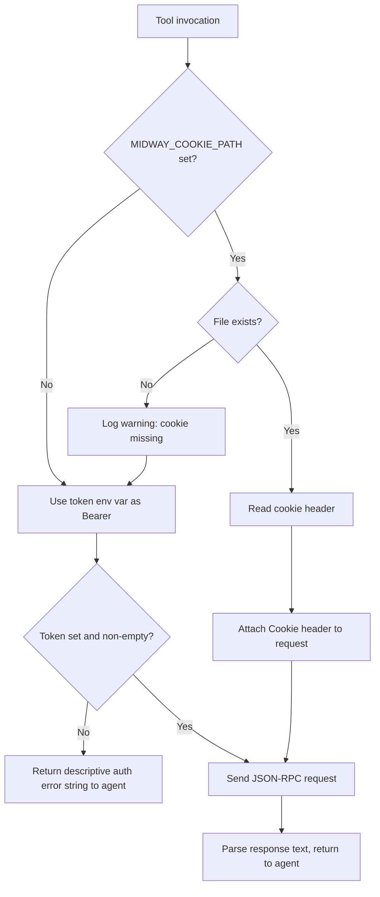

> **Superseded (2026-07-10).** This document specifies an HTTP JSON-RPC transport
> (`BUILDER_MCP_ENDPOINT` / `OUTLOOK_MCP_ENDPOINT` with bearer-token / Midway-cookie
> auth). The shipped implementation instead speaks **stdio** to the canonical
> `builder-mcp` and `aws-outlook-mcp` binaries — see
> `src/pm_agent_system/tools/builder_mcp.py`, `outlook_mcp.py`, and `_mcp_stdio.py` —
> which handle Midway auth themselves and are gated only on the binary being on
> `PATH`. Retained for historical design context; do not treat the JSON-RPC
> transport details below as current.

# Design Document

## Overview

This design integrates three internal Amazon MCP servers (builder-mcp, aws-outlook-mcp, and midway cookie sharing) into the existing PM Working Backwards CrewAI pipeline. The integration follows the established optional-tool pattern from the Dovetail integration. Each tool is conditionally wired to specific agents based on the presence of environment variables. When the tokens are unset, the pipeline runs unchanged.

Two new CrewAI tools are added under `src/pm_agent_system/tools/`:

- `BuilderMCPTool` (`builder_mcp.py`) wraps builder-mcp's JSON-RPC endpoint and exposes `wiki_search`, `code_search`, `taskei_search`, `quip_search`, and `pipeline_search` actions.
- `OutlookMCPTool` (`outlook_mcp.py`) wraps aws-outlook-mcp's JSON-RPC endpoint and exposes `calendar_search`, `email_search`, `room_availability`, and `schedule_summary` actions.

A shared `_mcp_jsonrpc.py` helper module provides a common JSON-RPC client (request envelope, retry policy, auth resolution, call logging). The two tools and any future MCP tool consume it to avoid code duplication. Authentication resolves in two tiers. The midway cookie file is primary and is shared across Windows and WSL. A token fallback (BUILDER_MCP_TOKEN, OUTLOOK_MCP_TOKEN) kicks in when the cookie is absent or expired.

Conditional wiring lives in `src/pm_agent_system/crew.py`. BuilderMCPTool attaches to `external_research_agent` and `brd_agent` when `BUILDER_MCP_TOKEN` or `MIDWAY_COOKIE_PATH` is set. OutlookMCPTool attaches to `prfaq_agent` and `brd_agent` when `OUTLOOK_MCP_TOKEN` or `MIDWAY_COOKIE_PATH` is set. Requirements 9 and 10 (schema and renderer extensions) are scoped as OPTIONAL in this design. The default path threads MCP content through existing `sources`, `context`, and prose fields. The extensions are flagged as opt-in work that can land in a follow-up without breaking this feature.

No existing agent behavior changes when the tokens are unset. The Dovetail integration remains the reference pattern for every detail of auth, retry, logging, and conditional attachment.

## Architecture

### System Context

The new tools sit alongside existing tools in the CrewAI agent layer. They do not change the agent topology, task graph, or output schemas in their MUST-have scope.



### Authentication Flow

Both tools share one auth resolver. The resolver is called on every invocation because cookies expire. Reading the file each call is cheap and avoids stale-cookie bugs.



If both the cookie path and token fallback resolve to nothing, `_run` returns a descriptive error string matching the shape of Dovetail's `"DOVETAIL_API_TOKEN not set"` message. It does not raise. The agent consumes the error, logs it, and continues per Requirement 7.3.

## Components and Interfaces

### Shared JSON-RPC Client: `src/pm_agent_system/tools/_mcp_jsonrpc.py`

Private helper module. The leading underscore prevents re-export from `tools/__init__.py`. It does not extend `BaseTool`. It provides module-level functions consumed by `BuilderMCPTool` and `OutlookMCPTool`.

Public interface:

```python
from dataclasses import dataclass
from pathlib import Path
from typing import Optional
import httpx
from tenacity import retry, stop_after_attempt, wait_exponential


@dataclass(frozen=True)
class MCPAuth:
    """Resolved auth material for one MCP call.

    Exactly one of `bearer_token` or `cookie_header` is set when auth
    succeeded. Both are None when no auth material is available.
    """
    bearer_token: Optional[str]
    cookie_header: Optional[str]


def resolve_auth(
    cookie_path_env: str,          # "MIDWAY_COOKIE_PATH"
    token_env: str,                # "BUILDER_MCP_TOKEN" or "OUTLOOK_MCP_TOKEN"
    logger,
) -> MCPAuth:
    """Resolve auth with cookie-first, token-fallback precedence."""


def build_headers(auth: MCPAuth) -> dict:
    """Produce HTTP headers from resolved auth. Includes Content-Type."""


@retry(stop=stop_after_attempt(3),
       wait=wait_exponential(multiplier=1, min=2, max=10),
       reraise=True)
def post_with_retry(url: str, json_payload: dict, headers: dict,
                    timeout: float) -> httpx.Response:
    """POST with 3-retry exponential backoff; raises on final failure."""


def jsonrpc_envelope(tool_name: str, arguments: dict,
                     request_id: int = 1) -> dict:
    """Produce the JSON-RPC 2.0 envelope for an MCP tools/call request."""


def extract_text(response_json: dict) -> str:
    """Extract the text content from an MCP tools/call response.

    Mirrors DovetailSearchTool._extract_text. Returns '' if empty."""


def call_mcp(
    endpoint_url: str,
    auth: MCPAuth,
    tool_name: str,
    arguments: dict,
    timeout: float = 30.0,
) -> str:
    """End-to-end: build envelope, send with retry, extract text.

    Raises httpx.HTTPStatusError on non-2xx after retries; callers convert
    to descriptive error strings."""


def log_call(log_path: Path, event: str, details: dict) -> None:
    """Append one JSON line to a per-tool call log. Never raises."""
```

Invariants of the envelope builder:

1. Output is a dict with exactly these top-level keys: `jsonrpc`, `method`, `params`, `id`.
2. `jsonrpc == "2.0"`.
3. `method == "tools/call"`.
4. `params == {"name": tool_name, "arguments": arguments}` (the caller's dict is nested verbatim).
5. The envelope serializes to JSON and round-trips back to an equal dict.

These invariants are testable via property-based tests (see Correctness Properties).

### BuilderMCPTool: `src/pm_agent_system/tools/builder_mcp.py`

Extends `crewai.tools.BaseTool`. Defers to `_mcp_jsonrpc` for transport. Mirrors Dovetail's structure: auth check, retry post, text extraction, action dispatch, call logging.

Args schema (Pydantic):

```python
class BuilderMCPInput(BaseModel):
    query: str = Field(..., description="Free-text query. Required.")
    action: str = Field(default="wiki_search", description=(
        "Action: 'wiki_search' | 'code_search' | 'taskei_search' | "
        "'quip_search' | 'pipeline_search'."))
    project_id: str = Field(default="", description=(
        "Optional project identifier for taskei_search or pipeline_search."))
    document_id: str = Field(default="", description=(
        "Optional document identifier for quip_search."))
    limit: int = Field(default=10, description="Max results (1 to 100).")
```

Action to MCP tool name mapping (the JSON-RPC `params.name` value sent to builder-mcp):

| Action | Remote tool name | Required args |
|---|---|---|
| `wiki_search` | `search_wiki` | `query`, `limit` |
| `code_search` | `search_code` | `query`, `limit` |
| `taskei_search` | `search_taskei` | `query`, `limit`, optional `project_id` |
| `quip_search` | `search_quip` | `query`, `limit`, optional `document_id` |
| `pipeline_search` | `search_pipelines` | `query`, `limit`, optional `project_id` |

> Note: the exact remote tool names are documented in the builder-mcp server. The table above reflects the contract BuilderMCPTool presents to the agent. If the internal server's tool names differ, only the `_dispatch` method's mapping strings change; the tool's public `action` values stay stable.

`_run` flow:

1. Log `invocation` with the full args payload to `output/builder_mcp_calls.log`.
2. Call `resolve_auth("MIDWAY_COOKIE_PATH", "BUILDER_MCP_TOKEN", logger)`. If both are unresolved, return the auth error string.
3. Read `BUILDER_MCP_ENDPOINT` from env. No default is set because the endpoint is tenant-specific. The config file guides users to set it.
4. Dispatch on `action`. Build the arguments dict. Call `call_mcp(endpoint, auth, remote_tool_name, args, timeout=30.0)`.
5. On `httpx.HTTPStatusError`, return `"Builder MCP error (HTTP {status}): {body[:300]}"`.
6. On generic `Exception`, return `"Error connecting to builder_mcp: {e}"`.
7. Log `response` with the first 300 chars of the returned text.

### OutlookMCPTool: `src/pm_agent_system/tools/outlook_mcp.py`

Same shape as BuilderMCPTool. Args schema:

```python
class OutlookMCPInput(BaseModel):
    query: str = Field(..., description="Free-text query. Required.")
    action: str = Field(default="calendar_search", description=(
        "Action: 'calendar_search' | 'email_search' | "
        "'room_availability' | 'schedule_summary'."))
    start_date: str = Field(default="", description=(
        "Optional ISO-8601 start date for date-ranged queries."))
    end_date: str = Field(default="", description=(
        "Optional ISO-8601 end date for date-ranged queries."))
    participants: str = Field(default="", description=(
        "Optional comma-separated participant aliases or emails."))
    limit: int = Field(default=10, description="Max results (1 to 100).")
```

Action mapping:

| Action | Remote tool name | Required args |
|---|---|---|
| `calendar_search` | `search_calendar` | `query`, `limit`, optional `start_date`, `end_date`, `participants` |
| `email_search` | `search_email` | `query`, `limit`, optional `start_date`, `end_date` |
| `room_availability` | `check_room_availability` | `query` (room name or list), `start_date`, `end_date` |
| `schedule_summary` | `summarize_schedule` | `participants`, optional `start_date`, `end_date` |

Email privacy rule (Requirement 3.6):

- `email_search` is the only action that requires output scrubbing.
- Before returning text to the agent, OutlookMCPTool runs `_scrub_email_bodies(raw_text)`. The scrubber parses the MCP response JSON, keeps only `subject`, `from`, `date`, `to`, `cc`, and a server-provided `summary` (or a first-200-character preview when no summary is present), and drops any `body`, `body_preview`, or `body_html` fields before re-serializing.
- If the raw response shape is unrecognized (non-JSON or missing expected keys), OutlookMCPTool returns a conservative error string rather than forwarding the raw body.

Other Outlook actions pass raw JSON through unchanged (no email body risk).

Scrubber invariant (testable as a property): for any input JSON structure, the scrubber output does not contain the keys `body`, `body_preview`, or `body_html` at any depth.

### Crew wiring: `src/pm_agent_system/crew.py`

Conditional-attachment helpers:

```python
def _builder_mcp_enabled() -> bool:
    """True when builder-mcp auth material is present."""
    if os.getenv("BUILDER_MCP_TOKEN", "").strip():
        return True
    cookie_path = os.getenv("MIDWAY_COOKIE_PATH", "").strip()
    if cookie_path and Path(cookie_path).exists():
        return True
    return False


def _outlook_mcp_enabled() -> bool:
    """True when outlook-mcp auth material is present."""
    if os.getenv("OUTLOOK_MCP_TOKEN", "").strip():
        return True
    cookie_path = os.getenv("MIDWAY_COOKIE_PATH", "").strip()
    if cookie_path and Path(cookie_path).exists():
        return True
    return False
```

Rationale for the OR logic: if the midway cookie is present and non-expired, the token is not needed. If only the token is set, the cookie isn't needed. The agent is enabled when either channel can authenticate. Missing-cookie fallback-to-token behavior is inside the tool's auth resolver (Requirement 5.5). Enablement at the crew level checks the union.

Agent attachment pattern (matches the Dovetail pattern in `customer_evidence_agent`):

```python
@agent
def external_research_agent(self) -> Agent:
    tools: list = [
        TavilySearchTool(),
        CompetitiveIntelTool(),
        FileReaderTool(),
        PriorArtSearchTool(),
        ObsidianSearchTool(),
        ObsidianReadTool(),
    ]
    if _builder_mcp_enabled():
        tools.append(BuilderMCPTool())
    return Agent(
        config=self.agents_config["external_research_agent"],
        tools=tools,
        llm=_llm(_LARGE_MAX_TOKENS),
        verbose=True,
    )

@agent
def prfaq_agent(self) -> Agent:
    tools: list = [
        FileReaderTool(),
        StyleGuideLoaderTool(),
        ObsidianSearchTool(),
        ObsidianReadTool(),
    ]
    if _outlook_mcp_enabled():
        tools.append(OutlookMCPTool())
    return Agent(...)

@agent
def brd_agent(self) -> Agent:
    tools: list = [
        TavilySearchTool(),
        AWSPricingTool(),
        AWSDocsSearchTool(),
        AWSDocsReadTool(),
        FileReaderTool(),
        RequirementsReaderTool(),
        StyleGuideLoaderTool(),
        ObsidianSearchTool(),
        ObsidianReadTool(),
    ]
    if _builder_mcp_enabled():
        tools.append(BuilderMCPTool())
    if _outlook_mcp_enabled():
        tools.append(OutlookMCPTool())
    return Agent(...)
```

`PmAgentSystem.__init__`, or a one-time module-level helper invoked from `main.py` startup, logs a single informational line naming which optional integrations are enabled and which are disabled. This satisfies Requirement 6.4. The existing `scripts/check_env.py` (Requirement 6.5) adds three new sections (Builder MCP, Outlook MCP, Midway Cookie), each reporting SET, UNSET, or MISCONFIGURED with the same style as `DOVETAIL_API_TOKEN`.

### Tool registration: `src/pm_agent_system/tools/__init__.py`

Add two exports:

```python
from pm_agent_system.tools.builder_mcp import BuilderMCPTool
from pm_agent_system.tools.outlook_mcp import OutlookMCPTool
```

Extend `__all__` accordingly. The shared `_mcp_jsonrpc` module is private and is not re-exported.

### Agent prompt updates: `src/pm_agent_system/config/agents.yaml`

Three backstories gain conditional instructions (Requirement 8). The edits are additive and wrapped in conditional language ("If the builder_mcp tool is available..."). The prompts stay accurate when the tools are absent. Banned-word rules continue to apply to every new sentence.

- `external_research_agent`: add a paragraph describing when to call BuilderMCPTool (wiki/code/Taskei/Quip for internal context the public web cannot reach). Instruct the agent to record an entry in `external_gaps` when the tool is absent or returns errors.
- `prfaq_agent`: add a paragraph describing when to call OutlookMCPTool (stakeholder scheduling context for the Internal FAQ). Instruct the agent to proceed without scheduling data when the tool is unavailable.
- `brd_agent`: add a paragraph describing when to call both tools. Builder is used for technical prior art and internal architecture context. Outlook is used for stakeholder availability feeding Timeline and Milestones.

Task descriptions in `tasks.yaml` (Requirement 8.4) gain one-paragraph additions in `external_research_task`, `research_synthesis_task`, `generate_prfaq`, and the BRD structure task. Each references the new tools as optional inputs with conditional language.

### Environment configuration: `.env.example`

Five new variables documented in a new "Internal Amazon MCP integrations (optional)" section:

```dotenv
# Internal Amazon MCP integrations (optional)
# All three are optional. When unset, the pipeline runs unchanged.
# See docs/internal-mcp-setup.md for cookie refresh workflow.

# Builder MCP: wiki, code search, Taskei, Quip, pipelines.
# BUILDER_MCP_TOKEN=
# BUILDER_MCP_ENDPOINT=  # e.g., https://your-internal-builder-mcp/api/mcp

# Outlook MCP: calendar, email metadata, room booking.
# OUTLOOK_MCP_TOKEN=
# OUTLOOK_MCP_ENDPOINT=  # e.g., https://your-internal-outlook-mcp/api/mcp

# Midway cookie sharing: one cookie file usable from Windows and WSL.
# When set and the file exists, the two MCP tools authenticate via the
# cookie and do not require the token env vars above. When the cookie
# file is missing or expired, the tools fall back to the token path.
# Refresh with: mwinit -f
# MIDWAY_COOKIE_PATH=
```

### Documentation: `docs/internal-mcp-setup.md`

New file (Requirement 5.6). Covers:

1. What the three MCP integrations do and when to enable each.
2. The `mwinit -f` workflow for refreshing cookies across Windows and WSL.
3. Where to find the cookie file on Windows, what path to set in WSL, and how the two environments can share the same file (symlink, shared mount, or a direct Windows path reachable from WSL via `/mnt/c/...`).
4. How to verify setup via `scripts/check_env.py`.
5. Troubleshooting: expired cookies, endpoint URL discovery, auth error strings, and the per-tool call logs under `output/`.

## Data Models

### In-Scope Model Changes (MUST-have)

None. The MUST-have scope of this feature adds no new fields to existing Pydantic models. MCP tool output flows through existing `sources`, `context`, and prose fields.

### Optional Model Changes (SHOULD, Requirement 9)

If Requirement 9 is approved for implementation:

- `ExternalResearchOutput` gains `internal_findings: list[str] = Field(default_factory=list, description="Findings from internal Amazon systems (wiki, code search, Taskei, Quip)")`.
- `ResearchOutput` gains `internal_sources: list[str] = Field(default_factory=list, description="Sources retrieved from internal MCP, separate from public sources")`.

Both fields default to empty lists. Existing code and existing output files remain valid.

If Requirement 9 is deferred (Requirement 9.4), no schema change lands. BuilderMCPTool output threads through the existing `sources` and prose fields. The agent is instructed (via the agents.yaml update) to prefix internal citations with `[internal:wiki]`, `[internal:code]`, etc., so downstream readers can still tell them apart without schema support.

## Correctness Properties

*A property is a characteristic or behavior that should hold true across all valid executions of a system, essentially a formal statement about what the system should do. Properties serve as the bridge between human-readable specifications and machine-verifiable correctness guarantees.*

Not every acceptance criterion in the requirements is amenable to property-based testing. This feature is mostly integration work (HTTP requests, environment variable plumbing, conditional wiring). Several acceptance criteria do describe pure-function invariants where input variation reveals bugs cheaply. Those are captured as properties below. Remaining criteria are classified as EXAMPLE, INTEGRATION, or SMOKE in the prework and tested via conventional unit or integration tests in the Testing Strategy.

### Property 1: JSON-RPC envelope structural invariants

*For any* string `tool_name` and any JSON-serializable dict `arguments`, the output of `jsonrpc_envelope(tool_name, arguments)` satisfies: `envelope["jsonrpc"] == "2.0"` and `envelope["method"] == "tools/call"` and `envelope["params"] == {"name": tool_name, "arguments": arguments}` and `json.loads(json.dumps(envelope)) == envelope`.

**Validates: Requirements 1.3, 3.3**

### Property 2: BuilderMCPInput args_schema validation

*For any* dict containing a non-empty string `query` and a string `action` drawn from the set `{"wiki_search", "code_search", "taskei_search", "quip_search", "pipeline_search"}`, optionally extended with string `project_id`, string `document_id`, and integer `limit` in `[1, 100]`, Pydantic validation of `BuilderMCPInput(**d)` succeeds. *For any* dict that omits `query`, validation raises `pydantic.ValidationError`.

**Validates: Requirements 1.4**

### Property 3: OutlookMCPInput args_schema validation

*For any* dict containing a non-empty string `query` and a string `action` drawn from the set `{"calendar_search", "email_search", "room_availability", "schedule_summary"}`, optionally extended with ISO-8601 `start_date`, `end_date`, comma-separated `participants`, and integer `limit` in `[1, 100]`, Pydantic validation of `OutlookMCPInput(**d)` succeeds. *For any* dict that omits `query`, validation raises `pydantic.ValidationError`.

**Validates: Requirements 3.4**

### Property 4: Conditional attachment for BuilderMCPTool

*For any* environment state in the Cartesian product of `BUILDER_MCP_TOKEN in {unset, empty, non-empty}` and `MIDWAY_COOKIE_PATH in {unset, set-and-missing, set-and-present}`, both `external_research_agent.tools` and `brd_agent.tools` contain a `BuilderMCPTool` instance if and only if `_builder_mcp_enabled()` returns `True` for that environment state.

**Validates: Requirements 2.1, 2.2, 2.3**

### Property 5: Conditional attachment for OutlookMCPTool

*For any* environment state in the Cartesian product of `OUTLOOK_MCP_TOKEN in {unset, empty, non-empty}` and `MIDWAY_COOKIE_PATH in {unset, set-and-missing, set-and-present}`, both `prfaq_agent.tools` and `brd_agent.tools` contain an `OutlookMCPTool` instance if and only if `_outlook_mcp_enabled()` returns `True` for that environment state.

**Validates: Requirements 4.1, 4.2, 4.3**

### Property 6: Email body scrubbing

*For any* JSON-serializable input structure (nested dicts and lists of arbitrary depth) in which any subset of the keys `body`, `body_preview`, and `body_html` may appear at any depth with any string values, the serialized output of `_scrub_email_bodies(input)` does not contain `body`, `body_preview`, or `body_html` as JSON keys at any depth. Preserved fields (`subject`, `from`, `date`, `to`, `cc`, `summary`) round-trip unchanged.

**Validates: Requirements 3.6**

### Property 7: Auth resolver precedence

*For any* combination of `cookie_path_state in {unset, set-and-missing, set-and-present-with-content}` and `token_state in {unset, empty, non-empty}`, the return value of `resolve_auth(cookie_env, token_env, logger)` satisfies: when the cookie path is set and the file exists, `result.cookie_header` is non-None and `result.bearer_token` is None; otherwise when the token is non-empty, `result.bearer_token` is non-None and `result.cookie_header` is None; otherwise both fields are None. When the cookie path is set but the file is missing, a warning-level log record is emitted before fallback.

**Validates: Requirements 5.2, 5.3, 5.4, 5.5**

### Property 8: MCP tool `_run` never raises on error

*For any* simulated failure in the HTTP transport (`httpx.HTTPStatusError` with any status code, `httpx.TimeoutException`, `httpx.ConnectError`, or a generic `Exception`), both `BuilderMCPTool._run(...)` and `OutlookMCPTool._run(...)` return a non-empty string that describes the error, and neither propagates the exception to the caller.

**Validates: Requirements 7.1, 7.2**

## Error Handling

### Transport Errors

Both tools wrap the HTTP call in try/except blocks that mirror `DovetailSearchTool._run`:

- `httpx.HTTPStatusError`: return `"<Tool Name> error (HTTP {status}): {body[:300]}"`. Log to the per-tool call log with the `http_error` event.
- `Exception` (catch-all): return `"Error connecting to <tool_name>: {e}"`. Log with the `exception` event.

Retries happen inside `post_with_retry` (3 attempts, exponential backoff with `multiplier=1, min=2, max=10`). Only the final exception propagates. If all three attempts fail, the outer try/except converts it to a string.

### Auth Errors

When the auth resolver returns an `MCPAuth` with both fields None, the tool returns `"<TOOL_ENV_VAR> not set in environment variables; set token or MIDWAY_COOKIE_PATH to enable <tool_name>."` and logs an `auth_error` event.

When `MIDWAY_COOKIE_PATH` is set but the file is missing or contains no content, the resolver logs a warning and proceeds to the token fallback. If the token is also missing, this degrades to the auth-error path above.

### Schema Errors

Pydantic validation runs on tool input before `_run` executes. CrewAI raises `ValidationError` when the LLM emits malformed tool arguments. This matches the Dovetail behavior. No new handling is required.

### Agent-Level Gap Recording

Per Requirement 7.3, agent prompts instruct each agent to record MCP unavailability in the appropriate gap field (`external_gaps` for research, `appendix_gaps` for PRFAQ, `risks` for BRD) when the tool returns an error string. This is prompt-driven behavior enforced at the LLM layer.

### No-Op Path for Unset Configuration

When `_builder_mcp_enabled()` returns False, `BuilderMCPTool` is never attached to any agent. No error path is ever reached. The agent sees only its original tool set and proceeds unaware of the MCP integration. Same for Outlook. This is the steady-state behavior for users outside Amazon.

## Testing Strategy

### Test Inventory

The test suite under `tests/` gains the following modules:

1. `tests/tools/test_builder_mcp.py`
   - Property tests for args_schema validation (Property 2).
   - Property test for `_run` error handling (subset of Property 8 scoped to Builder).
   - Example tests for each action mapping (Requirement 1.2): one mocked JSON-RPC response per action, asserts the remote tool name sent matches the mapping.
   - Example tests for retry and timeout (Requirement 7.4).
   - Example test for call logging (Requirement 7.6).

2. `tests/tools/test_outlook_mcp.py`
   - Property tests for args_schema validation (Property 3).
   - Property test for `_run` error handling (subset of Property 8 scoped to Outlook).
   - Property test for email body scrubbing (Property 6).
   - Example tests for each action mapping (Requirement 3.2).
   - Example tests for retry and timeout (Requirement 7.5).

3. `tests/tools/test_mcp_jsonrpc.py`
   - Property test for envelope construction (Property 1).
   - Property test for auth resolver precedence (Property 7).
   - Example test for `extract_text` with representative MCP responses.
   - Example tests for `log_call` (writes one JSON line per call, never raises).

4. `tests/test_crew_wiring.py`
   - Property tests for conditional attachment (Properties 4 and 5). Parameterize over the Cartesian product of environment states. Uses `monkeypatch` plus a `tmp_path` fixture for cookie file presence.
   - Smoke test: full pipeline crew builds successfully with all MCP tokens unset (Requirement 11.6). No network calls.

5. `tests/test_check_env_mcp.py`
   - Example tests for `scripts/check_env.py` reporting across env state combinations.

6. `tests/test_docs_present.py` (or an extension of an existing docs test)
   - SMOKE: grep `.env.example` for the five new variable names.
   - SMOKE: grep `docs/internal-mcp-setup.md` for `mwinit -f`.
   - SMOKE: grep `src/pm_agent_system/config/agents.yaml` for the conditional MCP language in each of the three backstories.

### Property-Based Testing Framework

The project already lists `hypothesis>=6.0` in the `dev` dependency group (see `pyproject.toml`). All property tests use Hypothesis.

### Test Configuration

- Every property test runs a minimum of 100 Hypothesis examples (the Hypothesis default). No per-test overrides unless a property requires more coverage.
- Each property test is tagged with a module-level comment referencing the design property:

```python
# Feature: internal-mcp-integration, Property 1: JSON-RPC envelope structural invariants
# For any string tool_name and any JSON-serializable dict arguments, ...
```

- Hypothesis strategies are shared in a `tests/tools/mcp_strategies.py` module (not exported from the package): JSON-serializable nested structures, environment-state tuples, simulated HTTP error factories.

### Example vs. Property Balance

Unit tests focus on specific action mappings, retry counts, timeout values, and log content. Property tests focus on the universal invariants listed in the Correctness Properties section. Every property is implemented by exactly one property-based test that references the numbered property in its docstring. Integration tests focus on the full-pipeline smoke path (Requirement 11.6) and on the agent-gap-recording behavior (Requirement 7.3), both with mocked MCP endpoints so no real network calls occur.

### Mocking Boundary

HTTP calls are mocked at the `httpx.post` level using `pytest-mock` or `respx`. No test calls a real MCP server. The `_mcp_jsonrpc.call_mcp` function is the mocking boundary for tool-level tests. The auth resolver reads real temp files for cookie presence tests (using `tmp_path`), which is cheap and exercises the real filesystem code path.

### Regressions and CI

The full property test suite completes in under 60 seconds locally (estimated based on the 100-iteration default and the pure-Python nature of these properties). CI runs all tests on every PR. Property-test failure surfaces the counterexample in the Hypothesis output, which is recorded in the spec's PBT tracking when a property test is first written.
