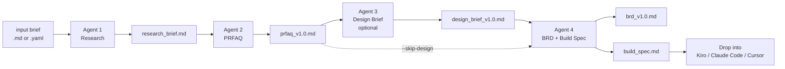

# Working Backwards Agent for Product Managers

An open-source multi-agent AI system that guides product managers from a rough problem statement through stakeholder-ready research, a Working Backwards PRFAQ, a design brief with screen inventory and user flows, a BRD, and an engineer-ready build spec. Built on [CrewAI](https://www.crewai.com/) and Claude.

This is for product managers, not engineers. If you can fill out a markdown template and copy-paste an API key, you can run it. See [SETUP.md](SETUP.md) for a step-by-step walkthrough that assumes you have never used a terminal.

## How it works



> Four agents, five artifacts. Agent 3 (Design Brief) synthesizes the PRFAQ and research into a screen inventory, user flows, and design principles. It's optional in the full pipeline — pass `--skip-design` to reproduce the three-agent behavior. Agent 4 produces two artifacts in sequence — the BRD first, then the build spec after you approve the BRD. In the code, Agent 4 is two tasks within one agent, not two separate agents. SVG wireframe generation is coming soon; today Agent 3 produces the design brief only.

You write a short problem statement. The agents do the research, write the Working Backwards document, translate it into requirements, and produce a build spec your engineers (or coding agent) can run with. You stay in the loop at every handoff.

## What This System Is Not

This system does not replace your existing tools:

- **Not a replacement for Jira or Linear.** It produces requirements, not tickets. You take the BRD's user stories and create tickets in your project management tool.
- **Not a replacement for Confluence or Notion.** It generates documents (PRFAQ, BRD) that you publish to your wiki. It references your existing docs rather than duplicating them.
- **Not a replacement for Figma or design tools.** The build spec describes what to build, not how it should look. Design happens alongside or after the BRD.
- **Not a replacement for your coding IDE.** Agent 4 produces a build spec that you load into Kiro, Claude Code, Cursor, or Lovable. The coding happens in your tool of choice.
- **Not a replacement for PM judgment.** Every artifact has a human review checkpoint. The system accelerates your first draft — you own the final version.

This system is the connective layer between research and execution. It takes a product problem and produces the artifacts that bridge the gap between "we should build this" and "here's exactly what to build and why."

## Input Format

The pipeline accepts your product brief as either a markdown file (recommended)
or a YAML file. Both produce identical results — pick whichever your workflow
prefers.

### Markdown (recommended for most PMs)

Copy the template and fill it in:

```bash
cp examples/templates/input-brief-template.md input/my-product.md
```

Open `input/my-product.md` in your text editor or Obsidian and fill in each
section. Then run:

```bash
uv run pm_agent_system full-pipeline input/my-product.md
```

If you use Obsidian with vault integration enabled, the input brief is
automatically copied into your product's vault folder alongside the
generated artifacts.

See [examples/input-brief-example.md](examples/input-brief-example.md) for a
completed reference.

### YAML (for developers and automation)

YAML input is still fully supported for CI/CD pipelines and developers who
prefer it:

```bash
uv run pm_agent_system full-pipeline input/my-product.yaml
```

See [examples/input.yaml](examples/input.yaml) for the YAML format.

> **Note:** JSON input files (`.json`) from earlier versions are no longer
> supported. If you have existing JSON inputs, convert them to markdown or
> YAML format.

## Quick start

Prerequisites: Python 3.11+, [uv](https://github.com/astral-sh/uv), an Anthropic API key, a Tavily API key.

```bash
git clone https://github.com/joegarvey-ai/pm-working-backwards-agent.git
cd pm-working-backwards-agent
crewai install
cp .env.example .env
# Open .env and paste in your ANTHROPIC_API_KEY and TAVILY_API_KEY
uv run pm_agent_system full-pipeline examples/input-brief-example.md
```

The first run takes 5-10 minutes and produces files in `./output/`. See [examples/](examples/) for what those files look like.

If you want to run the test suite locally, also run `uv sync --group dev` — this installs pytest and any other dev-only dependencies. See [CONTRIBUTING.md](CONTRIBUTING.md#running-tests) for the full test workflow.

The `examples/` directory contains sample input files (markdown and YAML), standalone-mode examples, and templates (style guide, customer requirements formats in `examples/templates/`). The `input/` directory is where you put your own input files — see [input/README.md](input/README.md).

For a step-by-step setup walkthrough written for non-technical users, read [SETUP.md](SETUP.md).

## Platform Support

This system runs in multiple environments. Choose the one that fits your workflow:

| Platform | How It Works | Setup Guide |
|---|---|---|
| **CLI** | Python commands in your terminal | [SETUP.md](SETUP.md) |
| **Kiro** | Native skills and custom agent | [docs/using-with-kiro.md](docs/using-with-kiro.md) |
| **Claude Code** | CLI from Claude Code terminal | [docs/using-with-claude-code.md](docs/using-with-claude-code.md) |
| **Claude Desktop / Projects** | Conversational with uploaded knowledge | [docs/using-with-claude-projects.md](docs/using-with-claude-projects.md) |
| **Cursor** | CLI + Composer with project rules | [docs/using-with-cursor.md](docs/using-with-cursor.md) |

**Don't know which to pick?** If you're comfortable with a terminal, use Claude Code or the CLI. If you prefer conversation, use Claude Desktop or a Claude.ai Project. If you're at Amazon, Kiro is the natural fit.

## Common Scenarios

Input file paths below show `.md` as the primary example. YAML input files (`.yaml`) are also supported — swap the extension and the rest of the command is identical.

| I need to... | Command |
|---|---|
| Validate a product idea with market research | `uv run pm_agent_system research input/my-product.md` |
| Write a stakeholder-ready PRFAQ from scratch | `uv run pm_agent_system generate input/my-product.md` |
| Run the full pipeline end to end | `uv run pm_agent_system full-pipeline input/my-product.md` |
| Revise a PRFAQ after a stakeholder review meeting | `uv run pm_agent_system revise --prfaq-path prfaq_v1.0.md --context-path notes.md` |
| Turn an approved PRFAQ into an engineer-ready BRD | `uv run pm_agent_system brd input/my-product.md --prfaq-path prfaq_v1.2.md` |
| Generate a Kiro build spec from a BRD | `uv run pm_agent_system build-spec --brd-path brd_v1.0.md --target-tool kiro` |
| Update a BRD after engineering feedback | `uv run pm_agent_system revise-brd --brd-path brd_v1.0.md --context-text "FR-003 needs a GSI"` |
| I have my own research and just need a PRFAQ | `uv run pm_agent_system generate input/my-product.md --research-path research.md` |
| I have an approved PRFAQ and my own requirements | `uv run pm_agent_system brd input/my-product.md --prfaq-path prfaq.md --requirements-path requirements.csv` |
| I want to visualize the product before writing requirements | `uv run pm_agent_system wireframes input/my-product.md --prfaq-path prfaq.md` |
| Revise a design brief after a review | `uv run pm_agent_system revise-wireframes --design-brief-path design_brief_v1.0.md --context-text "screen inventory needs a settings page"` |
| Run the full pipeline without the design brief | Add `--skip-design` to the `full-pipeline` command |
| Skip the assumption-challenge step | Add `--skip-validation` to any research/generate/full-pipeline command |
| Compare two document versions after a revision | `uv run pm_agent_system diff output/prfaq_v1.0.md output/prfaq_v1.1.md` |

Each command pauses for your review before producing the next artifact. See the [CLI Commands](#cli-commands) section below for full details, or the [Platform Support](#platform-support) section for non-CLI options.

### Reviewing Output

Every artifact is written to `output/` in two formats: a `.md` file for editing and version control, and a `.html` file for browser viewing. The HTML files are self-contained — you can email them, share them over Slack, or open them offline. Add `--open` to any pipeline command to auto-launch the HTML when the run finishes.

### Obsidian Vault Integration

If you use [Obsidian](https://obsidian.md) for note-taking, artifacts can be
written directly to your vault with frontmatter, version history, and
wikilinks connecting the full artifact chain (research → PRFAQ → design brief → BRD → build spec).

To enable:

1. Set `OBSIDIAN_VAULT_PATH` in your `.env` to your vault's root directory.
2. (Optional) Set `OBSIDIAN_FOLDER_PREFIX` to customize the top-level folder
   name (default: `PM Agent`).

Artifacts are written to `{vault}/{prefix}/{product-slug}/` with:
- The PM's input brief (`input_brief.md`) — copied from your source file with frontmatter so the vault folder holds the complete artifact chain from idea to build spec
- YAML frontmatter (tags, status, version, linked artifacts)
- A dashboard note (`_index.md`) summarizing all artifacts for the product
- Wikilinks connecting each artifact to its upstream and downstream neighbors
- Version history — revisions create new version files rather than overwriting
- A global map of content (`_all_products.md`) listing every product

Two optional fields in your input brief improve organization at scale:
- `Product Name` — a short name for cleaner vault folder slugs (otherwise derived from `Feature / Idea Summary`)
- `Initiative` — groups products into nested folders (e.g., `PM Agent/Commerce Platform/analytics-dashboard/`)

If your vault isn't set up, artifacts are still written to `output/` as usual.
The vault is optional and additive.

## CLI commands

Input file arguments below accept either `.md` (recommended) or `.yaml`/`.yml`.

| Command | What it does |
|---|---|
| `research <input>` | Run Agent 1 only. Produces a research brief. |
| `generate <input>` | Run Agents 1 + 2. Produces a research brief and a PRFAQ v1.0. |
| `revise --prfaq-path <file>` | Run Agent 2 to revise an existing PRFAQ. Pass `--context-text` or `--context-path` for the revision notes. |
| `wireframes <input> --prfaq-path <file>` | Run Agent 3 only. Produces a design brief from an approved PRFAQ. Pass `--research-path` to ground competitive UI patterns. |
| `revise-wireframes --design-brief-path <file>` | Revise an existing design brief. Pass `--context-text` or `--context-path` for the revision notes. |
| `full-pipeline <input>` | Run all agents end to end. Produces research brief, PRFAQ, design brief, BRD, and build spec. Add `--skip-design` to run the three-agent pipeline without Agent 3. |
| `brd <input> --prfaq-path <file>` | Run Agent 4 to produce a BRD and build spec from an approved PRFAQ. Pass `--design-brief-path` to have the BRD reference screen names and flows. |
| `build-spec --brd-path <file>` | Regenerate just the build spec from an approved BRD. Useful when switching `--target-tool`. |
| `revise-brd --brd-path <file>` | Revise an existing BRD. Pass `--context-text` or `--context-path` for the revision notes. |
| `diff <old> <new>` | Compare two document versions section by section. Shows which sections were added, removed, or changed. Works best with agent-generated document pairs — manual header renames between versions appear as a deletion plus an addition rather than a single change. |
| `clean --archive` / `--list` / `--delete-archive` | Manage the `./output/` directory retention policy. |

Run `uv run pm_agent_system <command> --help` for the full options on any command.

Every BRD generation also produces `brd_*_jira_import.csv` and `brd_*_linear_import.md` files in the output directory, ready to import into Jira or Linear. Column names and field labels are configurable — edit `config/jira_import_schema.yaml` and `config/linear_import_schema.yaml` to match your instance before importing.

## Configuration

All configuration lives in `.env`. Copy `.env.example` to `.env` and fill it in.

| Variable | Required | What it is |
|---|---|---|
| `ANTHROPIC_API_KEY` | yes | Your Anthropic API key. The agents use Claude. |
| `TAVILY_API_KEY` | yes | Your Tavily API key. The research agent uses Tavily for web search and competitive intelligence. |
| `DOVETAIL_API_TOKEN` | no | Optional. If you have a Dovetail UX research workspace, the research agent will pull customer evidence from it. Leave blank to skip. |
| `STYLE_GUIDE_PATH` | no | Path to your writing style guide. Defaults to `examples/templates/style-guide-sample.md`. |
| `OBSIDIAN_VAULT_PATH` | no | Optional. Path to your Obsidian vault if you want the agents to search your notes. |
| `OUTPUT_DIR` | no | Where output files go. Defaults to `./output/`. |
| `DEFAULT_TARGET_TOOL` | no | Which coding tool the build spec is formatted for. One of `kiro`, `claude_code`, `cursor`, `lovable`. Defaults to `kiro`. |
| `AWS_PRICING_REGION` | no | AWS region for pricing lookups. Defaults to `us-east-1`. The AWS Pricing API is public but boto3 may need credentials — see `.env.example`. |
| `OUTPUT_RETENTION_DAYS` | no | How many days output files live before being archived. Defaults to 30. |

## Architecture

Four agents, each with a single job, chained by a CrewAI orchestrator. Agent 4 produces two artifacts (BRD, then build spec) as two sequential tasks within one agent. Agent 3 is optional; pass `--skip-design` to run the pipeline without it.

| Agent | Job | Tools |
|---|---|---|
| 1. Research | Gather evidence from web, customer research, and internal notes | Tavily web search, competitive intelligence (G2/Capterra/TrustRadius), Dovetail (optional), Obsidian (optional), file readers |
| 2. PRFAQ | Turn the research brief into a Working Backwards press release and FAQ | Style guide loader |
| 3. Design Brief + Wireframe | Synthesizes the PRFAQ and research into a design brief: screen inventory, user flows, design principles, competitive UI patterns. Optionally generates visual wireframes (coming soon). | File reader, Obsidian (optional) |
| 4. BRD + Build Spec | Translate the approved PRFAQ (and design brief, if present) into requirements (BRD) and format them into a coding-agent-ready build spec | Tavily (cost flags, API doc lookups), AWS Pricing API (exact per-unit pricing for cost flags) |

The orchestrator lives in `src/pm_agent_system/crew.py`. Agent and task definitions are in `src/pm_agent_system/config/agents.yaml` and `tasks.yaml`. Each agent's outputs are validated against a Pydantic model in `src/pm_agent_system/models/`.

A human-in-the-loop checkpoint sits between every stage. The agents do not auto-advance from research to PRFAQ or PRFAQ to BRD. You read the output, decide if it is good, and either approve it or run the `revise` command.

## Known limitations

- The system has been tested on a small number of product problems. It works well for "we want to build X for Y users" but has not been stress-tested on M&A diligence, pricing strategy, or pure platform engineering problems.
- Agent 1 only knows what it can find via Tavily, Dovetail, your Obsidian vault, and any files you point it at. It cannot access paywalled research or your internal Slack.
- Output quality depends heavily on the input. A vague input gets a vague output. The example in `examples/input.yaml` shows the level of specificity that produces good results.
- A full pipeline run costs roughly $1-3 in API usage at current Claude pricing. Run `research` first if you want a cheap sanity check before committing.
- This is research software. It is not enterprise-ready. There is no auth, no multi-tenancy, no audit log.

## License

[MIT](LICENSE). Use it, fork it, ship it.

## Contributing

Pull requests welcome. See [CONTRIBUTING.md](CONTRIBUTING.md) for the short version of how to help.
