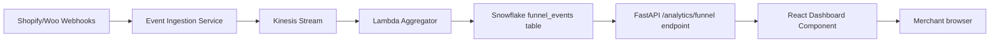

# Build Spec: Self-Service Conversion Analytics Dashboard

## Context for the coding agent

You are building a self-service conversion analytics dashboard inside an existing e-commerce SaaS platform. The platform is a Python/FastAPI backend with a React/TypeScript frontend. Data lives in PostgreSQL (transactional) and Snowflake (analytical). Authentication and merchant scoping are handled by the existing platform middleware. Do not reinvent them.

## Goal

Ship FR-1 through FR-8 (the P0 functional requirements from the BRD) behind a feature flag, with NFR-1 (5-min data freshness) and NFR-2 (≤2s P95 page load) met.

## Architecture

## Tasks

### Task 1: Snowflake schema

Create a `funnel_events` table in Snowflake with columns:
- `event_id` (string, PK)
- `merchant_id` (string, indexed)
- `session_id` (string)
- `event_type` (enum: product_view, add_to_cart, checkout_start, purchase_complete)
- `sku` (string, nullable)
- `traffic_source` (string)
- `device` (string)
- `event_ts` (timestamp)

Partition by `merchant_id` and `event_ts` (daily).

### Task 2: Aggregator Lambda

Write a Python Lambda that consumes from the existing Kinesis stream `merchant-events-prod`, transforms each event into a `funnel_events` row, and writes to Snowflake in 1-minute micro-batches. Reuse the existing `kinesis_consumer_base` package. Target throughput: 50,000 events/minute.

### Task 3: Backend endpoint

Add a FastAPI endpoint `GET /api/v1/analytics/funnel` with query params:
- `start_date`, `end_date` (ISO 8601)
- `sku[]` (optional, multi)
- `traffic_source[]` (optional, multi)
- `device[]` (optional, multi)
- `compare_to_prior_period` (bool, default false)

Return JSON with funnel counts per stage and (if compare flag set) prior-period counts. Cache in Redis with a 60-second TTL keyed by merchant_id + query hash.

### Task 4: React dashboard component

Build `<FunnelDashboard />` in `frontend/src/features/analytics/`. Use the existing chart library (`@platform/charts`). Include:
- Date range picker (presets: today, 7d, 30d, 90d, custom)
- SKU multi-select (autocomplete, fetches from `/api/v1/products/search`)
- Traffic source and device multi-selects
- Funnel visualization (4 stages, conversion rate between each)
- Period-over-period toggle
- Export CSV button (calls `/api/v1/analytics/funnel/export`)

Wrap the entire component in the existing `<FeatureFlag name="funnel_dashboard">` gate.

### Task 5: Tests

- Unit tests for the aggregator transform logic.
- Integration test that posts a synthetic event through Kinesis and asserts it appears in the API within 6 minutes (5 min freshness target + 1 min slack).
- Cypress E2E test that loads the dashboard, applies a SKU filter, and asserts the funnel updates.

## Acceptance criteria

- `/api/v1/analytics/funnel` returns correct counts for a known fixture dataset.
- Synthetic event appears in dashboard within 5 minutes (measured P95 over 100 runs).
- P95 page load ≤ 2 seconds in staging (measured via existing Lighthouse CI).
- Feature flag off = component does not render. Feature flag on = component renders for users on Growth or Plus plan only.
- All tests pass in CI.

## Out of scope for this build

- Anomaly highlighting (FR-7) — defer to v1.1.
- Shareable view URLs (FR-9) — defer to v1.1.
- In-app onboarding tour (FR-10) — handled by the growth team in a separate ticket.
- BigCommerce support — not in v1 at all.
